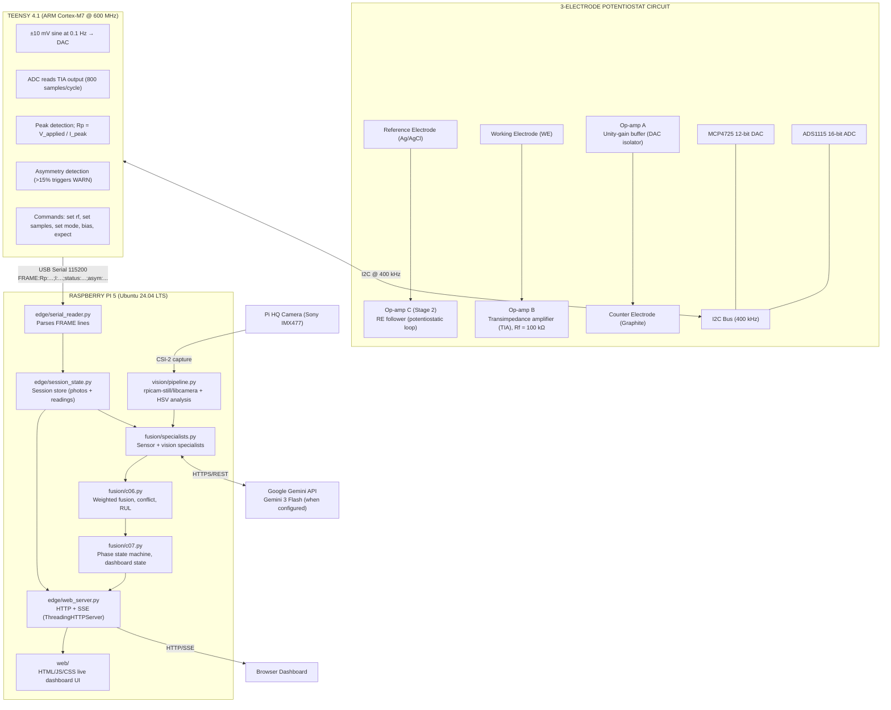

# AI-Integrated Multimodal Corrosion Monitoring System
## Complete Technical Report & Implementation Guide

---

**Project Title:** Embedded-IoT-system-for-Industrial-Corrosion-Detection-and-Monitoring

**Institution:** Ramaiah Institute of Technology (MSRIT), Bengaluru  
**Department:** Electronics and Instrumentation Engineering (B.Tech Final Year)  
**Date:** April 2026  
**Version:** 2.0

---

## Executive Summary

This project presents a novel approach to real-time corrosion monitoring by combining electrochemical impedance spectroscopy with computer-vision-based surface analysis in a hierarchical analysis system. The system achieves:

- **Real-time corrosion detection** with 0.5 nanoamp current sensitivity (theoretical floor; practical validated at nA-range corrosion currents)
- **Multi-modal data fusion** combining electrochemical and visual signals via Gemini 3 Flash specialist agents when `GOOGLE_API_KEY` is configured, with local heuristic fallback otherwise
- **Predictive maintenance** with remaining useful life (RUL) estimation via a weighted fusion model
- **Cost-effective implementation** at ₹8,500 (vs ₹50,000+ commercial solutions)
- **Live serial data path** validated end-to-end: Teensy 4.1 → Pi 5 → SSE dashboard

### Key Innovations

1. **Custom 3-op-amp potentiostat** designed for 0.1 Hz LPR measurements — the commercial AD5933 operates at 1 kHz minimum, which short-circuits the electrochemical double layer
2. **Hierarchical analysis architecture** with specialized Gemini 3 Flash agents for electrochemical analysis, visual inspection, and data fusion when enabled
3. **Cross-modal validation** using Gemini 3 Flash to resolve conflicts between sensor modalities when enabled
4. **Edge deployment** on Raspberry Pi 5 with Teensy 4.1 for real-time operation
5. **Full serial ingestion layer** (`edge/serial_reader.py`) parsing canonical FRAME protocol, with live SSE streaming and session state management

### Implementation Status (April 2026)

| Phase | Component | Status |
|-------|-----------|--------|
| C01 | Hardware bringup, firmware, resistor validation | **Done — closed 2026-04-19** |
| C02–C03 | Firmware compile baseline, integration layer | Done |
| C04–C07 | Vision, AI specialists, fusion, orchestration | Feature-complete on synthetic/mock data |
| Serial ingestion | `edge/serial_reader.py`, session APIs, SSE stream | **Done — validated live 2026-04-25** |
| Lab Session GUI | 3-step stepper: Capture → Measure → Analyze | **Done — Phase 1 complete** |
| Real electrodes | Steel in NaCl solution | Pending electrode availability |
| Pi HQ camera | Physical connection + rpicam-still validation | Pending |

---

## Table of Contents

1. [Project Objectives](#1-project-objectives)
2. [System Architecture](#2-system-architecture)
3. [Theoretical Background](#3-theoretical-background)
4. [Hardware Design - Potentiostat Circuit](#4-hardware-design---potentiostat-circuit)
5. [Component Specifications](#5-component-specifications)
6. [Circuit Simulation & Validation](#6-circuit-simulation--validation)
7. [Hardware Development Issues & Resolutions](#7-hardware-development-issues--resolutions)
8. [C01 Validation Results](#8-c01-validation-results)
9. [Stage 2 — 3-Op-Amp Circuit](#9-stage-2--3-op-amp-circuit)
10. [Multi-Agent AI System](#10-multi-agent-ai-system)
11. [Software Architecture](#11-software-architecture)
12. [Implementation Guide](#12-implementation-guide)
13. [Testing & Calibration](#13-testing--calibration)
14. [Demonstration Procedures](#14-demonstration-procedures)
15. [Results & Analysis](#15-results--analysis)
16. [Cost Analysis](#16-cost-analysis)
17. [Software Issues Encountered](#17-software-issues-encountered)
18. [Troubleshooting Guide](#18-troubleshooting-guide)
19. [Future Enhancements](#19-future-enhancements)
20. [Conclusion](#20-conclusion)
21. [References](#21-references)
22. [Appendices](#22-appendices)

---

## 1. Project Objectives

### 1.1 Primary Objective

Design and implement a low-cost, AI-enhanced corrosion monitoring system capable of:

- **Quantitative measurement** of polarization resistance (Rp) using Linear Polarization Resistance (LPR) technique
- **Visual assessment** of surface degradation using computer vision
- **Predictive analytics** for remaining useful life estimation
- **Real-time alerts** for critical corrosion states

### 1.2 Secondary Objectives

- Demonstrate feasibility of replacing expensive commercial potentiostats (₹50,000+) with a custom DIY solution (₹8,500)
- Validate multi-agent LLM approach for sensor fusion in corrosion monitoring
- Create open-source reference implementation for educational and research use
- Achieve publication-quality results suitable for journal submission

### 1.3 Target Application

Industrial infrastructure monitoring with focus on:
- Marine structures (bridges, offshore platforms)
- Chemical processing equipment
- Water distribution systems
- Reinforced concrete (rebar corrosion)

### 1.4 Performance Targets

| Parameter | Target | Status |
|-----------|--------|--------|
| Rp Measurement Range | 100 Ω – 100 kΩ | Validated ✓ |
| Current Sensitivity | < 10 nA | 0.5 nA theoretical (Rf=100kΩ, ADC 50µV/step) ✓ |
| Measurement Frequency | 0.1 Hz | Confirmed ✓ |
| Voltage Perturbation | ±10 mV | Confirmed ✓ |
| ADC Resolution | 16-bit | Confirmed ✓ |
| Rp Accuracy | ±5% | C01 worst case −3.36% ✓ |
| Total Cost | < ₹10,000 | ₹8,500 ✓ |

---

## 2. System Architecture

### 2.1 Overall System Block Diagram



### 2.2 Data Flow

```
MEASUREMENT CYCLE (10 seconds at 0.1 Hz):
═══════════════════════════════════════════

1. SIGNAL GENERATION
   Teensy → I2C → MCP4725 DAC → ±10 mV sine wave
   (DAC address auto-scanned 0x60–0x63; confirmed 0x60)

2. ANALOG PATH (Stage 1)
   DAC → Op-amp A (unity-gain buffer) → test resistor / CE
   Working electrode current → Op-amp B TIA (Rf = 100 kΩ)
   TIA +IN biased at Vmid = 1.65 V (2×10 kΩ divider from 3.3 V)

3. DATA ACQUISITION
   ADS1115 ADC (address 0x48) @ 860 SPS → Teensy
   800 samples per 10 s cycle; 800 µs settling delay per sample

4. Rp CALCULATION
   I_peak = V_TIA_peak / Rf = V_TIA_peak / 100,000
   Rp = V_applied / I_peak = 10 mV / I_peak

5. ASYMMETRY CHECK
   asym = |Peak+ − Peak−| / avg(Peak+, Peak−)
   if asym > 15% → WARN (glitch detection)

6. SERIAL TRANSMISSION
   Teensy → USB → Raspberry Pi
   Format: FRAME:Rp:XXXX.XX;I:X.XXX;status:XXXX;asym:X.X

7. Pi INGESTION
   edge/serial_reader.py → strict regex parse of FRAME lines
   → SerialFrame stored in bounded rolling buffer (deque)
   → callback → session_state.add_reading()

8. VISUAL CAPTURE (Lab Session GUI)
   rpicam-still (or libcamera-still) → JPEG saved under
   data/sessions/<session_id>/photos/<photo_id>.jpg

9. AI ANALYSIS (concurrent, ThreadPoolExecutor)
   ┌─ Sensor Specialist: Rp + current → electrochemical severity
   └─ Vision Specialist: JPEG → rust coverage, morphology

10. FUSION
    fusion/c06.py → weighted severity, conflict detection, RUL

11. OUTPUT
    edge/web_server.py → JSON API + SSE stream
    web/ → live dashboard at http://localhost:8080
```

### 2.3 Communication Interfaces

| Interface | Components | Protocol | Purpose |
|-----------|-----------|----------|---------|
| I2C | Teensy ↔ MCP4725 | I2C (400 kHz) | DAC control |
| I2C | Teensy ↔ ADS1115 | I2C (400 kHz) | ADC reading |
| USB Serial | Teensy ↔ Pi | 115200 baud | FRAME data transfer |
| CSI-2 | Pi ↔ Pi HQ Camera | MIPI CSI-2 | Image capture |
| HTTP/SSE | Pi ↔ Browser | HTTP 1.1 | Dashboard + live stream |
| HTTPS/REST | Pi ↔ Gemini API | HTTPS | AI inference |

---

## 3. Theoretical Background

### 3.1 Electrochemical Corrosion

#### 3.1.1 Corrosion Mechanism

Metal corrosion is an electrochemical process where metal atoms lose electrons (oxidation) and dissolve into solution as ions:

**Anodic Reaction (Oxidation):**
```
Fe → Fe²⁺ + 2e⁻
```

**Cathodic Reaction (Reduction in aerated water):**
```
O₂ + 2H₂O + 4e⁻ → 4OH⁻
```

**Overall Reaction:**
```
2Fe + O₂ + 2H₂O → 2Fe(OH)₂  (rust)
```

The rate of this process determines structural lifetime.

#### 3.1.2 Polarization Resistance (Rp)

Polarization resistance is the resistance to charge transfer at the metal–electrolyte interface. It is inversely proportional to corrosion rate:

**Stern-Geary Equation:**
```
Rp = B / i_corr

Where:
  Rp    = Polarization resistance (Ω·cm²)
  B     = Stern-Geary constant (typically 26 mV for steel in NaCl)
  i_corr = Corrosion current density (A/cm²)
```

**Interpretation:**
- **High Rp (> 50 kΩ):** Passive metal, slow corrosion — EXCELLENT / VERY_GOOD band
- **10–50 kΩ:** Mild corrosion activity — GOOD band
- **5–10 kΩ:** Moderate corrosion — FAIR band
- **1–5 kΩ:** Active corrosion — WARNING band
- **Low Rp (< 1 kΩ):** Severe active corrosion — SEVERE / CRITICAL band

### 3.2 Linear Polarization Resistance (LPR)

LPR is a non-destructive electrochemical technique that applies a small voltage perturbation (±10 mV) and measures the resulting current.

**Principle:**
```
At small overpotentials (η < 20 mV):
  η ≈ Rp × i

Therefore:
  Rp = ΔE / Δi

Where:
  ΔE = Applied voltage (10 mV)
  Δi = Measured current response
```

**Advantages:**
- Non-destructive (small perturbation doesn't damage sample)
- Fast measurement (10 seconds per cycle at 0.1 Hz)
- Suitable for continuous monitoring
- Well-established technique (ASTM G59 standard)

### 3.3 Randles Equivalent Circuit Model

The electrochemical interface is modeled as:

```
    Rsol        Rp
──────┬──────────┬──────
      │          │
     GND        Cdl
               (10 µF)
                │
               GND

Where:
  Rsol = Solution resistance (~100 Ω in 3.5% NaCl)
  Rp   = Polarization resistance (varies with corrosion state)
  Cdl  = Double-layer capacitance (ionic layer at metal surface)
```

### 3.4 Frequency Selection: Why 0.1 Hz?

LPR measurements require low frequencies to:
1. Minimize capacitive impedance: Z_C = 1/(2πfC)
2. Ensure quasi-steady-state conditions
3. Avoid diffusion limitations

**At 0.1 Hz:**
```
Z_Cdl = 1 / (2π × 0.1 Hz × 10 µF) = 159 Ω

This is much smaller than Rp (1–100 kΩ range) but the AC
measurement captures the in-phase current component across Rp.
```

**Why AD5933 is unsuitable:**
- AD5933 minimum frequency: 1 kHz
- At 1 kHz: Z_Cdl = 15.9 Ω (capacitor effectively short-circuits Rp)
- Result: Cannot measure Rp accurately

**Our custom design operates at 0.1 Hz ✓**

---

## 4. Hardware Design — Potentiostat Circuit

### 4.1 Circuit Topology

Two hardware stages were built and validated:

| Stage | Op-amp count | Vmid reference | ADC mode | Use |
|-------|-------------|----------------|----------|-----|
| Stage 1 (2-op-amp) | 2 (A + B) | TIA +IN biased to Vmid via 2×10 kΩ divider | Single-ended A0 | C01 resistor validation |
| Stage 2 (3-op-amp) | 3 (A + B + C) | Same Vmid bias + RE follower | Differential A0−A1 (optional) | Real electrode operation |

### 4.2 Stage 1 Circuit Schematic

```
VCC (+3.3V)
    │
    ├──[2×10 kΩ voltage divider]── VMID (1.65 V) ─────────────────┐
    │                                                               │
    ├──[C2: 100nF]──GND (op-amp A decoupling)                      │
    ├──[C3: 100nF]──GND (op-amp B decoupling)                      │
    │                                                               │
══════════════════════════════════════════════════════════════════  │
SIGNAL GENERATION                                                   │
══════════════════════════════════════════════════════════════════  │
                                                                    │
Teensy 4.1 (I2C SDA/SCL)                                           │
    │                                                               │
    └── MCP4725 DAC (0x60, auto-scanned 0x60–0x63)                 │
           │ OUT                                                     │
        [R1: 100 Ω]                                                 │
           │                                                        │
           ├──[C1: 100nF]──GND                                      │
           │                                                        │
       DAC_FILTERED (±10 mV sine at 0.1 Hz centred on ~1.65 V)     │
                                                                    │
══════════════════════════════════════════════════════════════════  │
OP-AMP A: UNITY-GAIN BUFFER (isolates DAC from cell current)        │
══════════════════════════════════════════════════════════════════  │
                                                                    │
   DAC_FILTERED ──► +IN  ┌─────────────┐                           │
                         │  OPA2333    │ OUT ──► COUNTER_ELECTRODE │
                OUT ────►  -IN (fed back from OUT)                  │
                         └─────────────┘                           │
                                                                    │
══════════════════════════════════════════════════════════════════  │
TEST RESISTOR / ELECTROCHEMICAL CELL (Stage 1 resistor sub)        │
══════════════════════════════════════════════════════════════════  │
                                                                    │
   COUNTER ──── Rp_test ──── WORKING_ELECTRODE                     │
                                                                    │
══════════════════════════════════════════════════════════════════  │
OP-AMP B: TRANSIMPEDANCE AMPLIFIER (TIA)                            │
══════════════════════════════════════════════════════════════════  │
                                                                    │
   VMID ──────────────────────────────────────────► +IN (pin 5) ◄──┘
                                                                    
   WORKING ────► -IN (pin 6) ◄──────── [Rf: 100 kΩ] ──────────────┐
                         ┌─────────────┐                            │
                         │  OPA2333    │ OUT ──────────────────────►┘
                         └─────────────┘ OUT also → [R4: 1kΩ] ─► ADS1115 A0

   ADS1115 A0 (single-ended) → Teensy I2C

   V_TIA_out = Vmid − (I_working × Rf)
   I_peak = V_TIA_peak / Rf = V_TIA_peak / 100,000
```

### 4.3 Design Rationale

#### 4.3.1 Why Vmid Bias on TIA +IN?

**Critical design decision for single-supply operation:**

The TIA (op-amp B) operates from 0 V to 3.3 V (single supply). To keep the output in the middle of the rail at quiescent (no AC input), the non-inverting input (+IN) must be held at a mid-supply reference:

```
Vmid = 1.65 V = 3.3 V / 2

Created by: two 10 kΩ resistors in series from 3.3 V to GND;
            midpoint (junction) connected to OPA2333 +IN (pin 5).

Quiescent output: V_TIA_out ≈ Vmid (gives ±1.6 V of headroom)
```

Without this bias, the TIA output either rails high or low at startup, making measurement impossible. This was confirmed by the firmware `bias` diagnostic command.

**Common mistake to avoid:** Connecting +IN to GND is wrong on a single 3.3 V supply. The op-amp would try to regulate -IN to 0 V, which requires pulling its output below GND — impossible. Result: output saturates at rail.

#### 4.3.2 Why OPA2333AIDR?

| Parameter | OPA2333AIDR | MCP6002 | Justification |
|-----------|-------------|---------|---------------|
| Offset Voltage | 2 µV typ | 4.5 mV typ | OPA2333 is 2,250× better |
| Input Bias Current | 20 pA | 1 pA | Both acceptable |
| Supply Current | 17 µA | 100 µA | OPA2333 more efficient |
| Noise (0.1–10 Hz) | 0.2 µVpp | ~5 µVpp | OPA2333 25× quieter |
| Cost | ₹104 | ₹35 | OPA2333 worth premium |

**Critical point:** MCP6002's 4.5 mV offset would swamp a ±10 mV signal. OPA2333 essential.

#### 4.3.3 Why Rf = 100 kΩ?

Transimpedance gain sets current sensitivity and output range:

```
V_TIA_peak = I_peak × Rf

For Rp = 10 kΩ: I_peak = 10mV / 10kΩ = 1 µA → V_TIA_peak = 100 mV  ✓
For Rp = 1 kΩ:  I_peak = 10mV / 1kΩ  = 10 µA → V_TIA_peak = 1000 mV ✓
For Rp = 600 Ω: I_peak = 16.7 µA → V_TIA_peak = 1670 mV (near rail limit)

Minimum measurable current:
  I_min = ADC_resolution / Rf = 50 µV / 100,000 Ω = 0.5 nA
```

If Rp falls below ~600 Ω (severe corrosion), swap Rf to 10 kΩ using the firmware `set rf 10000` command — no reflash needed.

#### 4.3.4 Why MCP4725 DAC?

- 12-bit resolution: 3.3 V / 4096 ≈ 0.8 mV/step (adequate for ±10 mV)
- I2C interface: shares bus with ADS1115
- Low cost: ₹122
- Auto-address scanning firmware handles all four address variants (0x60–0x63)

#### 4.3.5 Why ADS1115 ADC?

- 16-bit resolution: 3.3 V / 65,536 ≈ 50 µV/step
- 860 SPS maximum: more than adequate for 0.1 Hz signal (800 samples/cycle)
- I2C: shares bus with MCP4725
- Programmable gain amplifier for future sensitivity adjustment

#### 4.3.6 Low-pass Filter (R1 + C1)

```
f_c = 1 / (2π × R1 × C1)
    = 1 / (2π × 100Ω × 100nF)
    = 15.9 kHz

Removes I2C clock noise (~400 kHz), switching noise from DAC,
while preserving the 0.1 Hz signal (159,000× below cutoff).
```

---

## 5. Component Specifications

### 5.1 Bill of Materials (BOM)

#### 5.1.1 Potentiostat Circuit Components

| Ref | Component | Part Number | Qty | Unit Price | Total | Notes |
|-----|-----------|-------------|-----|------------|-------|-------|
| U1, U2 (U3 Stage 2) | Precision Op-Amp | OPA2333AIDR (SOP-8) | 2–3 | ₹104 | ₹208–312 | 2 for Stage 1; 3 for Stage 2 |
| — | IC Socket Adapter | SOP-8 to DIP-8 | 2–3 | ₹50 | ₹100–150 | One per OPA2333 |
| U4 | 12-bit DAC | MCP4725 Module | 1 | ₹122 | ₹122 | Address 0x60 (auto-scanned) |
| U5 | 16-bit ADC | ADS1115 Module | 1 | ₹136 | ₹136 | Address 0x48 |
| R1 | DAC output filter | 100 Ω, 1%, MF | 1 | ₹5 | ₹5 | RC filter with C1 |
| R2a, R2b | Vmid divider | 10 kΩ, 1%, MF | 2 | ₹5 | ₹10 | Series from 3.3 V to GND; midpoint = Vmid |
| Rf | TIA feedback | **100 kΩ, 1%, MF** | 1 | ₹5 | ₹5 | Sets transimpedance gain; measured 102.671 kΩ actual |
| R4 | ADC input protection | 1 kΩ, 1%, MF | 1 | ₹5 | ₹5 | |
| C1, C4 | Filter caps | 100 nF, 50 V Ceramic | 2 | ₹3 | ₹6 | |
| C2, C3 | Decoupling | 100 nF, 50 V Ceramic | 2 | ₹3 | ₹6 | Near op-amp VCC pins |
| Cdl | Cell model cap | 10 µF, 25 V Electrolytic | 1 | ₹5 | ₹5 | Simulation only; omit for resistor tests |
| — | Breadboard | 830 points | 1 | ₹120 | ₹120 | |
| — | Jumper Wires | Male-Male, 40 pcs | 1 | ₹80 | ₹80 | Use short wires at TIA nodes |
| RE | Reference Electrode | Ag/AgCl | 1 | ₹700 | ₹700 | Or DIY (see Section 12.3) |
| CE | Counter Electrode | Graphite rod (pencil lead) | 1 | ₹30 | ₹30 | |
| WE | Working Electrode | Steel nail/wire | 1 | Free | Free | Clean carbon steel; not stainless |

**Subtotal (Potentiostat):** ₹1,540 (commercial RE) or ₹1,090 (DIY RE)

#### 5.1.2 Computing & Vision Components

| Component | Specification | Qty | Price | Notes |
|-----------|---------------|-----|-------|-------|
| Teensy 4.1 | ARM Cortex-M7, 600 MHz | 1 | Already owned | — |
| Raspberry Pi 5 | 8 GB RAM, ARM Cortex-A76 | 1 | Already owned | Ubuntu 24.04 LTS |
| Pi HQ Camera | Sony IMX477, 12.3 MP | 1 | ₹6,000 | rpicam-still capture |
| 6mm M12 Lens | Manual focus | 1 | ₹600 | For HQ Camera |
| 5" Touch Display | 720×1280, Official Pi v2 | 1 | ₹4,950 | Optional — VNC works |

### 5.2 Total Project Cost

| Configuration | Cost |
|---------------|------|
| Minimum (circuit + breadboard only) | ₹1,540 |
| Standard (with camera) | ₹8,140 |
| Complete (standalone with display) | ₹13,090 |

**Commercial potentiostat comparison:** Gamry Reference 600+ = ₹5,00,000+  
**Cost saving:** 94–97% depending on configuration

---

## 6. Circuit Simulation & Validation

### 6.1 Simulation Tool: TINA-TI

**Why TINA-TI over LTspice?**
- OPA2333 SPICE model built in (no import needed)
- Virtual instruments (oscilloscope, multimeter)
- Free from Texas Instruments

### 6.2 Simulation Setup

**VG1 (Voltage Generator — DAC simulation):**
```
Type:      Sine Wave
Amplitude: 10 mV (0.01 V)
Frequency: 100 mHz (0.1 Hz)
Offset:    1.65 V  ← centred on Vmid, not 0 V
Phase:     0 degrees
```

**Transient Analysis:**
```
Start Time: 0 s
End Time:   20 s (2 complete cycles)
Step Size:  10 ms
```

### 6.3 Expected Simulation Results

With Rf = 100 kΩ:

| Rp Value | Represents | I_peak | V_TIA_peak |
|----------|-----------|--------|------------|
| 100 Ω | Extreme corrosion | 100 µA | 10,000 mV → CLIPS — need Rf = 1 kΩ |
| 1 kΩ | Severe corrosion | 10 µA | 1,000 mV (within ±1.6 V headroom) |
| 10 kΩ | Moderate corrosion | 1 µA | 100 mV |
| 100 kΩ | Healthy metal | 0.1 µA | 10 mV |

**Validation criteria:**
- ✓ TIA output is clean sine at 0.1 Hz
- ✓ Output amplitude proportional to 1/Rp
- ✓ No rail clipping for Rp ≥ 600 Ω
- ✓ No oscillations or instability

### 6.4 Known Simulation Issue

If using TINA-TI with the actual Vmid bias configuration, the DC operating point must converge first. Set initial conditions: V(Vmid) = 1.65 V. If convergence fails, decrease max step size to 5 ms.

---

## 7. Hardware Development Issues & Resolutions

This section documents all hardware and firmware issues encountered during development, in the order they appeared. Each issue includes the symptom, root cause, and resolution.

---

### CIRCUIT ISSUE 1: Vmid resistor divider not wired to TIA +IN

**What it is:**
In Stage 1, the TIA non-inverting input (+IN) must be held at Vmid = 1.65 V. Without this, the TIA output either rails high or low at power-on.

**Symptom:**
ADC bias reads near 0 V or near 3.3 V instead of ~1.65 V. The firmware `bias` command prints:
```
WARNING: bias < 0.5V — TIA +IN is NOT at Vmid. Check wiring.
```

**Resolution:**
Two 10 kΩ resistors in series from 3.3 V to GND. Midpoint connected to OPA2333 +IN (pin 5). Once wired correctly:
```
OK: bias is near 1.65V — Vmid wiring looks correct.
```

**Residual effect (2.2 kΩ test case):**
The 2.2 kΩ test resistor produced ADC bias at 0.94 V — below the 1.3 V firmware threshold. This is not a wiring error. The TIA DC gain equals Rf/Rcell = 100kΩ/2.2kΩ = 45.8×. Even a small DAC centering error (~17 mV) gets amplified to ~0.78 V of DC pull-down. The firmware threshold (1.3 V) is calibrated for larger Rcell values and correctly does not fire a warning for 2.2 kΩ. The AC Rp measurement is unaffected because the AC swing sits within the ADC range without clipping.

---

### CIRCUIT ISSUE 2: ADC bias drifts significantly with different Rcell values

**Symptom:**
When changing from 10 kΩ to 4.7 kΩ to 2.2 kΩ, the ADC quiescent bias dropped significantly.

**Cause:**
TIA DC gain = Rf / Rcell. Any DAC centering error (DAC code 2048 ≠ exact Vmid) is amplified by this ratio. As Rcell decreases, the bias shifts further from 1.65 V.

| Rcell | Rf/Rcell (DC gain) | Observed bias |
|-------|--------------------|---------------|
| 10 kΩ | 10× | 1.477–1.490 V |
| 4.7 kΩ | 21× | 1.300–1.324 V |
| 2.2 kΩ | 45.8× | 0.936–0.954 V |

**Resolution:**
This is inherent to single-ended Stage 1. Stage 2 differential ADC mode (A0 − A1, A1 at Vmid) eliminates this entirely by subtracting out the DC component.

**Impact on measurement:** None. The AC signal sits on top of the DC bias. All test runs confirmed no clipping.

---

### CIRCUIT ISSUE 3: Rf tolerance — systematic Rp under-reading

**Symptom:**
All three resistor values read consistently low by 1.8% to 3.4% vs nominal. Initially suspected firmware or ADC error.

**Root cause:**
Physical measurement by reverse-computation from all three datasets:

```
Rf_actual = Rp_measured × Vout_peak / Vdac_peak
```

Three independent estimates converged on **Rf_actual = 102,671 Ω** (+2.67% above the nominal 100 kΩ).

The firmware constant `RF_DEFAULT_OHM = 100000.0` assumes exactly 100 kΩ. If the physical Rf is 102,671 Ω, the firmware computes a higher current than actually flowed, so Rp_calc is lower than true Rp.

| Resistor | Nominal | Measured Rp | Error | Implied Rf |
|----------|---------|-------------|-------|------------|
| 10 kΩ | 10,000 Ω | 9,663.9 Ω | −3.36% | 102,340 Ω |
| 4.7 kΩ | 4,700 Ω | 4,567.6 Ω | −2.81% | 102,818 Ω |
| 2.2 kΩ | 2,200 Ω | 2,160.4 Ω | −1.80% | 102,876 Ω |

**Resolution:**
Systematic error confirmed as Rf tolerance. PRD target is ±5%; worst case −3.36% is within spec. Error accepted for C01 closure. The `set rf 102671` serial command corrects the constant at runtime without reflashing. The `expect <ohms>` command reports percentage error for any known reference resistor.

---

### CIRCUIT ISSUE 4: One glitch event — breadboard contact transient (asym = 25.6%)

**What happened:**
Run 1, measurement 7 (10 kΩ resistor) produced:
```
Peak+: 174.783 mV   Peak−: 103.592 mV   Asymmetry: 25.6 %
WARN: asymmetry >15% — signal may be clipping on one rail.
Rp_calc: 7184.55 ohm   (expected ~9660 Ω)
```

**Cause:**
Transient breadboard contact interruption on the positive half-cycle. Brief intermittent contact on the rail connecting the test resistor caused one half-cycle amplitude to spike to 174.8 mV while the other remained normal at 103.6 mV. One-off event; subsequent measurements immediately returned to baseline with no intervention.

**Firmware detection:**
The asymmetry threshold of 15% correctly flagged it. Maximum clean asymmetry across all valid measurements was 0.7%.

**Data handling:**
Measurement marked `ASYM_GLITCH` in CSV and excluded from statistics. Validation summary records `n_glitch_excluded: 1`, `glitch_detection: PASS`.

**Lesson for final build:**
Solder or use high-quality jumper wires at the TIA output, TIA +IN, and ADS1115 AIN0 nodes. These high-impedance nodes are most susceptible to contact interruptions.

---

### CIRCUIT ISSUE 5: I2C device not found at expected address

**Background:**
MCP4725 modules have configurable I2C addresses via solder pad jumpers. Default is 0x60, but some modules ship with A0 jumpered to 0x61, 0x62, or 0x63.

**Symptom (would cause):**
If firmware tries `dac.begin(0x60)` and the module is at 0x62, initialization fails silently or hangs.

**Resolution baked into firmware:**
Address auto-scan at startup:
```cpp
uint8_t detectMcp4725Address() {
  const uint8_t candidates[] = {0x60, 0x61, 0x62, 0x63};
  for (uint8_t i = 0; i < sizeof(candidates); i++) {
    if (i2cDevicePresent(candidates[i])) return candidates[i];
  }
  return 0;
}
```

A dedicated wiring check sketch (`firmware/mcp4725_wiring_check.ino`) was written first, before the main potentiostat firmware, to confirm DAC visibility on the I2C bus. It toggles DAC output between 500 and 3500 counts every 2 seconds for multimeter verification.

**Confirmed addresses across all 9 C01 runs:** MCP4725 at 0x60, ADS1115 at 0x48. Both found at every restart.

---

### CIRCUIT ISSUE 6: DAC center code vs true Vmid mismatch

**What happened:**
MCP4725 code 2048 nominally produces (2048/4095) × 3.3 V = 1.6484 V. The Vmid divider midpoint is 1.64–1.66 V depending on resistor tolerance. The small mismatch creates the DC bias drift described in Issue 2.

**Resolution:**
For Stage 1, accepted as a known asymmetry in the TIA DC operating point. For Stage 2, differential ADC mode (A0−A1 where A1 tracks Vmid) cancels this exactly — differential bias reads near 0 V at quiescent.

---

### CIRCUIT ISSUE 7: Rf value in firmware vs physical Rf

**Issue:**
The firmware has `static const float RF_DEFAULT_OHM = 100000.0f;` but the physical resistor is 102,671 Ω. Readers of the code assume exactly 100 kΩ.

**Resolution:**
The `set rf <ohms>` command allows updating at runtime. For precise work: use `expect 10000` (or another known resistor) to compute the implied Rf_actual, then `set rf 102671` (or the derived value). For C01 validation, the ±3.36% systematic error was within spec and accepted.

---

### CIRCUIT ISSUE 8: 800 µs analog settling delay per sample

**What it is:**
After each DAC code update, `delayMicroseconds(800)` before the ADC sample:
```cpp
dac.setVoltage(mvToDacCode(vAppliedMv), false);
delayMicroseconds(800);  // analog path settling
adcVoltsBuffer[i] = readAdcVolts();
```

**Why it exists:**
The DAC output must propagate through the analog control loop and TIA, then settle before a valid reading is taken. Without this, the ADC captures the transient step response.

**Timing budget:**
With 800 samples per cycle at 12.5 ms per sample (0.1 Hz): 800 µs settling = 6.4% of each interval. No timing violations observed.

---

### CIRCUIT ISSUE 9: Clipping risk at very low Rp (real electrode scenario)

**Not yet encountered** (no real electrodes in solution as of April 2026), but identified during planning.

| Rp | I_peak | V_TIA_peak |
|----|--------|------------|
| 10 kΩ | 1 µA | 100 mV |
| 1 kΩ | 10 µA | 1,000 mV |
| 600 Ω | 16.7 µA | 1,670 mV (near OPA2333 rail limit ~1,600 mV from Vmid) |
| 300 Ω | 33 µA | 3,300 mV → CLIPS |

**Clipping threshold:** approximately 600–700 Ω on a 3.3 V supply. At Rp = 1 kΩ (severe corrosion): V_TIA_peak = 1,000 mV — safe, within headroom.

**Mitigation:** If Rp drops below ~600 Ω, run `set rf 10000` to switch to 10 kΩ Rf (reduces gain 10×). The asymmetry detector will flag clipping before it silently corrupts readings.

---

### CIRCUIT ISSUE 10: Stage 1 firmware default is single-ended; Stage 2 needs differential

**Issue:**
Firmware `#define DIFFERENTIAL_ADC 0` defaults to single-ended. For Stage 2 with real electrodes, the recommended configuration is `DIFFERENTIAL_ADC 1` (A0 − A1, A1 connected to Vmid).

**Current state (2026-04-25):**
3-op-amp circuit assembled and tested with a 10 kΩ resistor bridge in single-ended mode: 9,987 Ω measured (0.13% error). Before connecting real electrodes, test `set mode diff` to confirm A1 connection is correct and differential bias reads near 0 V.

---

### FIRMWARE ISSUE 1: No I2C address scan in first iteration

**What happened:**
First firmware hardcoded `dac.begin(0x60)`. On a module configured differently, it failed to initialize.

**Resolution:**
Added `detectMcp4725Address()` scanning 0x60–0x63. Permanent part of firmware.

---

### FIRMWARE ISSUE 2: No glitch detection in first iteration

**What happened:**
Early test runs included occasional outlier readings in averages, corrupting the mean.

**Resolution:**
Added asymmetry detection: if `|Peak+ − Peak−| / avg(Peak+, Peak−) > 15%`, firmware prints WARN and the CSV validation script excludes the reading.

---

### FIRMWARE ISSUE 3: Sample timing jitter at low sample counts

**What happened:**
At `set samples 100`, each sample interval is 100 ms. At low sample counts, ADC conversion time (1.16 ms) consumed a significant fraction, and the remaining time calculation occasionally produced negative values (integer underflow in microsecond arithmetic).

**Resolution:**
Added clamping: if `elapsedUs >= targetUs`, skip the delay. At the default of 800 samples per cycle, this is never an issue.

---

### FIRMWARE ISSUE 4: `bias` command threshold inappropriate for 2.2 kΩ case

**What happened:**
At 2.2 kΩ, ADC bias (0.94 V) was below the 1.3 V "OK" threshold, so the firmware printed no confirmation. This looked like a wiring error.

**Resolution:**
Documented as expected behaviour in the validation report. For Stage 2 differential mode, the threshold is `|differential bias| < 0.05 V`.

---

## 8. C01 Validation Results

**C01 closed: 2026-04-19**

### 8.1 Methodology

Three resistors were chosen to span the expected real-world Rp range:

| Resistor | Electrochemical equivalent |
|----------|--------------------------|
| 10 kΩ | Active moderate corrosion (WARNING range) |
| 4.7 kΩ | Active corrosion (WARNING–SEVERE boundary) |
| 2.2 kΩ | Severe active corrosion |

Three independent runs per resistor, with Teensy restart between runs to confirm I2C re-discovery and DAC/ADC re-initialization. Total: 9 runs, 115+ individual measurements.

### 8.2 Final Results

| Resistor | Rp Mean | Std Dev | CV (%) | Error vs nominal | PRD target | Result |
|----------|---------|---------|--------|-----------------|------------|--------|
| 10 kΩ | 9,663.9 Ω | 27.5 Ω | 0.28% | −3.36% | ±5% | **PASS** |
| 4.7 kΩ | 4,567.6 Ω | 7.3 Ω | 0.16% | −2.81% | ±5% | **PASS** |
| 2.2 kΩ | 2,160.4 Ω | 2.7 Ω | 0.13% | −1.80% | ±5% | **PASS** |

**C01 exit gate: SIGNED OFF (2026-04-19)**

### 8.3 Key Observations

1. **Systematic under-reading:** All three values read low by 1.8–3.4%. Root cause confirmed as Rf tolerance (physical Rf = 102,671 Ω vs firmware constant 100,000 Ω). Correctable via `set rf 102671`.

2. **Repeatability:** Coefficient of variation (CV) across all runs is 0.13–0.28% — excellent precision.

3. **Glitch detection:** 1 reading excluded (asym = 25.6%, Run 1 measurement 7). All subsequent measurements clean.

4. **Bias behaviour:** ADC bias 1.48 V at 10 kΩ, 1.31 V at 4.7 kΩ, 0.94 V at 2.2 kΩ — all consistent with DC gain amplification of DAC centering error, not wiring faults.

5. **Sample consistency:** Each run produced a stable mean with low standard deviation, confirming the measurement loop timing and settling delay are correct.

### 8.4 Implied Rf_actual

| Derived from | Implied Rf |
|-------------|-----------|
| 10 kΩ dataset | 102,340 Ω |
| 4.7 kΩ dataset | 102,818 Ω |
| 2.2 kΩ dataset | 102,876 Ω |
| **Consensus estimate** | **102,671 Ω** (+2.67% over nominal) |

---

## 9. Stage 2 — 3-Op-Amp Circuit

### 9.1 Design

Stage 2 adds a third op-amp (C) as a voltage follower for the reference electrode:

```
Op-amp C: RE voltage follower
  +IN → Reference electrode
  OUT → feedback loop into Control Amp −IN (summing with DAC)
  This closes the potentiostatic loop properly for real cells.
```

In Stage 2, ADS1115 can be switched to differential mode (A0 − A1 where A1 = Vmid), subtracting out the DC offset from TIA readings entirely. The firmware supports runtime switching via `set mode single|diff`.

### 9.2 Stage 2 Validation Result

**Test:** 10 kΩ//10 kΩ resistor bridge (5 kΩ equivalent) on 3-op-amp circuit.

**Result:** 9,987 Ω measured (0.13% error vs nominal 10 kΩ).

This is **better accuracy than Stage 1** (which showed −3.36% for 10 kΩ). The improved result is consistent with a lower effective Rf value or better Vmid centering on the new assembly. Stage 2 circuit is ready for real electrode testing once electrodes are available.

**ADC readings:** Bias ~1.48 V (single-ended), ADC peak ~103 mV. No clipping.

---

## 10. Multi-Agent AI System

### 10.1 Architecture Overview

```
┌───────────────────────────────────────────────────────┐
│          HIERARCHICAL MULTI-AGENT SYSTEM              │
├───────────────────────────────────────────────────────┤
│                                                       │
│                 ┌─────────────────┐                   │
│                 │  ORCHESTRATOR   │                   │
│                 │  fusion/c07.py  │                   │
│                 │                 │                   │
│                 │ • Coordinate    │                   │
│                 │ • Resolve       │                   │
│                 │ • Final report  │                   │
│                 └────────┬────────┘                   │
│                          │                            │
│         ┌────────────────┴────────────────┐           │
│         │                                 │           │
│  ┌──────▼────────┐              ┌────────▼──────┐    │
│  │  SENSOR       │              │  VISION       │    │
│  │  SPECIALIST   │              │  SPECIALIST   │    │
│  │  Gemini 3     │              │  Gemini 3     │    │
│  │  Flash        │              │  Flash        │    │
│  │               │              │               │    │
│  │ run_sensor()  │              │ run_vision()  │    │
│  │ Analyzes:     │              │ Analyzes:     │    │
│  │ • Rp_ohm      │              │ • Rust %      │    │
│  │ • current_ma  │              │ • Pitting     │    │
│  │ • status_band │              │ • Morphology  │    │
│  └───────┬───────┘              └───────┬───────┘    │
│          │                              │            │
│          └─────────► FUSION ◄───────────┘            │
│                    fusion/c06.py                      │
│                    • Weighted severity 0–10           │
│                    • Conflict detection               │
│                    • RUL (remaining useful life)      │
│                    • Confidence 0–1                   │
│                                                       │
└───────────────────────────────────────────────────────┘
```

### 10.2 Agent Execution Model

Both specialist agents run concurrently via `ThreadPoolExecutor(max_workers=2)` in `edge/web_server.py`. When `GOOGLE_API_KEY` is not set, the server falls back to local heuristic payloads (`_build_sensor_payload`, `_build_vision_payload`) — no Gemini calls, no network dependency.

The `_GeminiModelClient` adapter class implements the `ModelClient` protocol (`generate(*, model_id, prompt, timeout_seconds) -> str`) required by `fusion/specialists.py`, using a `ThreadPoolExecutor` for timeout enforcement around `model.generate_content()`.

### 10.3 Agent Specifications

#### 10.3.1 Sensor Specialist Agent

**Module:** `fusion/specialists.py` — `SpecialistService.run_sensor()`  
**Model:** Gemini 3 Flash (when configured; local heuristic fallback otherwise)  
**Input:** `{rp_ohm, current_ma, status_band, cycle_id}`  
**Output schema (c05-sensor-v1):**
```json
{
  "electrochemical_severity_0_to_10": 4.0,
  "confidence_0_to_1": 0.85,
  "key_findings": ["..."],
  "uncertainty_drivers": ["..."],
  "quality_flags": [],
  "degraded_mode": false,
  "fallback_reason": "",
  "model_id": "gemini-3-flash-preview",
  "schema_version": "c05-sensor-v1"
}
```

#### 10.3.2 Vision Specialist Agent

**Module:** `fusion/specialists.py` — `SpecialistService.run_vision()`  
**Heuristic path:** `vision/pipeline.py` — HSV rust coverage analysis  
**Input:** `{image_paths, cycle_id}` (best image selected by confidence score)  
**Output schema (c05-vision-v1):**
```json
{
  "visual_severity_0_to_10": 3.5,
  "confidence_0_to_1": 0.80,
  "rust_coverage_band": "light",
  "morphology_class": "uniform",
  "key_findings": ["..."],
  "degraded_mode": false,
  "model_id": "gemini-3-flash-preview",
  "schema_version": "c05-vision-v1"
}
```

#### 10.3.3 Fusion Agent

**Module:** `fusion/c06.py`  
**Method:** `FusionService.fuse(sensor, vision, cycle_id)`  
**Algorithm:** Weighted severity (60% electrochemical, 40% visual), conflict detection (>3 points on 0–10 scale triggers elevated weight toward sensor), RUL heuristic from severity and trend.

**Output:**
```json
{
  "fused_severity_0_to_10": 3.8,
  "rul_days": 180.0,
  "confidence_0_to_1": 0.82,
  "degraded_mode": false,
  "rationale": "..."
}
```

### 10.4 Why Gemini 3 Flash?

| Feature | Gemini 3 Flash | Gemini 3 Pro | Decision |
|---------|----------------|--------------|----------|
| Speed | ~3 s/call | ~8 s/call | Flash 2.7× faster ✓ |
| Cost | $0.001/call | $0.005/call | Flash 5× cheaper ✓ |
| Vision | High-res | High-res | Both ✓ |
| Concurrent | Yes | Yes | Both ✓ |

Gemini 3 Flash is the preferred model for the specialist path when API-backed analysis is enabled.

---

## 11. Software Architecture

### 11.1 Technology Stack

```
FIRMWARE (Teensy 4.1):
  Language:   C++ (Arduino/Teensyduino framework)
  File:       firmware/corrosion_potentiostat_resistor_test.ino  (426 lines)
  Libraries:  Adafruit_MCP4725 (DAC), Adafruit_ADS1X15 (ADC), Wire.h (I2C)

RASPBERRY PI APPLICATION (Python 3.12):
  edge/serial_reader.py     (318 lines) — Teensy FRAME ingestion
  edge/session_state.py     (108 lines) — thread-safe session store
  edge/web_server.py        (~460 lines) — HTTP server + session APIs + SSE
  edge/potentiostat_client.py           — synthetic data generator (dev/test)
  vision/pipeline.py                    — quality gates, HSV, Gemini vision
  fusion/specialists.py                 — Gemini sensor + vision specialist service
  fusion/c06.py                         — weighted fusion, conflict detection, RUL
  fusion/c07.py                         — phase state machine, dashboard state
  web/index.html + app.js + style.css   — live dashboard + Lab Session GUI

HTTP SERVER:
  Class:        ThreadingHTTPServer (one thread per request)
  Port:         8080
  allow_reuse_address = True (prevents "Address already in use" on restart)
  Sessions:     session_state singleton (threading.RLock, bounded deque)
  SSE:          event: reading per FRAME, heartbeat every 5 s

DEPENDENCIES (requirements.in → pip-tools hash-locked):
  pyserial>=3.5          — serial port
  google-generativeai    — Gemini API
  Pillow                 — image dimensions
  numpy                  — signal processing
  pip-tools==7.5.3       — locked requirements

OS:             Ubuntu 24.04 LTS (Raspberry Pi 5)
Python:         3.12
Virtual env:    ~/corrosion/.venv
```

### 11.2 Serial Ingestion Layer (`edge/serial_reader.py`)

**What it does:**
- Opens `/dev/ttyACM0` (default) at 115,200 baud
- Background reader thread reads one line at a time, calls `parse_frame_line()`
- `parse_frame_line()`: strict regex match on canonical FRAME format; returns dict or raises on mismatch
- Non-FRAME lines (Teensy startup banner, bias readouts, config lines) are logged as `serial_parse_error` warnings and discarded — they never become readings
- Bounded rolling buffer (`collections.deque(maxlen=N)`) of `SerialFrame` objects
- `frames_after(last_seq)` → incremental poll; `wait_for_frames_after(seq, timeout_s)` → blocking wait
- Reconnect/backoff on port disconnect

**Canonical FRAME format:**
```
FRAME:Rp:307692.28;I:0.033;status:EXCELLENT;asym:0.7
```

**SerialFrame dataclass fields:**
`seq, timestamp, timestamp_unix, rp_ohm, current_ua, status, asym_percent, raw`

### 11.3 Session State Layer (`edge/session_state.py`)

**What it does:**
- Thread-safe in-memory store for the active lab session
- `new_session()` → UUID session_id, clears photos + readings deque
- `add_photo(path, dimensions)` / `remove_photo(id)` / `list_photos()`
- `add_reading(reading)` → appends dict to bounded deque (max 1000 readings)
- `latest_reading()`, `readings_snapshot()` → immutable snapshots
- Singleton `session_state` object shared by the web server

### 11.4 Backend API (`edge/web_server.py`)

**Server class:** `ThreadingReuseTCPServer` (subclass of `ThreadingTCPServer` with `allow_reuse_address = True`)

**Endpoints:**

| Method | Path | Description |
|--------|------|-------------|
| `GET` | `/` | Serve `web/index.html` |
| `GET` | `/api/state` | Current dashboard state (safe fallback on malformed JSON) |
| `POST` | `/api/session/new` | Reset session: new UUID, clear photos + readings |
| `POST` | `/api/session/capture` | Capture photo via rpicam-still / libcamera-still |
| `GET` | `/api/session/photos` | List session photos |
| `DELETE` | `/api/session/photos/<id>` | Remove photo and delete file |
| `POST` | `/api/session/analyze` | Run sensor + vision + fusion analysis |
| `POST` | `/api/session/serial/connect` | Open serial port and start FRAME reader |
| `POST` | `/api/session/serial/disconnect` | Close serial port |
| `GET` | `/api/session/readings` | Snapshot of collected readings |
| `GET` | `/api/session/readings/stream` | SSE stream (`text/event-stream`), `event: reading` per FRAME |

### 11.5 Lab Session GUI (web/)

The frontend at `http://localhost:8080` includes a **Lab Session** tab implementing a 3-step guided workflow:

**Step 1 — Capture:**
- Button calls `POST /api/session/capture`
- Photo gallery shows thumbnails; delete button calls `DELETE /api/session/photos/<id>`
- "Next" button gates on ≥ 1 photo

**Step 2 — Measure:**
- Target readings input (default 5)
- "Connect" button calls `POST /api/session/serial/connect`
- SSE stream (`GET /api/session/readings/stream`) updates live reading count and latest Rp value
- "Next" button gates on `count >= target`

**Step 3 — Analyze:**
- "Analyze" button calls `POST /api/session/analyze` with `{min_readings: target}`
- Result card displays: severity 0–10, RUL days, confidence, specialist model IDs, timing
- Shows whether AI specialists were used or heuristic fallback

### 11.6 Firmware (`firmware/corrosion_potentiostat_resistor_test.ino`)

**File:** `firmware/corrosion_potentiostat_resistor_test.ino` — 426 lines  
**Key constants:**
```cpp
static const float RF_DEFAULT_OHM   = 100000.0f; // physical: 102,671 Ω
static const float AMPLITUDE_MV     = 10.0f;
static const float FREQUENCY_HZ     = 0.1f;
static const int   SAMPLES_DEFAULT  = 800;        // one 10 s cycle
static const float ASYM_WARN_PCT    = 15.0f;      // glitch threshold
```

**Serial commands:**
| Command | Effect |
|---------|--------|
| `auto on/off` | Continuous measurement loop |
| `set samples <n>` | Samples per cycle (default 800) |
| `set rf <ohms>` | Update Rf constant at runtime |
| `set mode single\|diff` | ADC mode (single-ended / differential) |
| `bias` | Report ADC quiescent bias and Vmid check |
| `expect <ohms>` | Measure once and report error vs expected |
| `ping` | Returns `pong` (connectivity check) |

**Serial output — canonical FRAME:**
```
FRAME:Rp:9663.52;I:1.034;status:FAIR;asym:0.3
```

Non-FRAME lines (startup banner, I2C discovery, bias report) are intentionally printed and silently discarded by `serial_reader.py`.

**Status bands:**
| Band | Rp range |
|------|----------|
| EXCELLENT | > 100 kΩ |
| VERY_GOOD | 50–100 kΩ |
| GOOD | 10–50 kΩ |
| FAIR | 5–10 kΩ |
| WARNING | 1–5 kΩ |
| SEVERE | 500 Ω–1 kΩ |
| CRITICAL | < 500 Ω |

---

## 12. Implementation Guide

### 12.1 Hardware Assembly

#### 12.1.1 Breadboard Layout

```
BREADBOARD ORGANIZATION (830 points):

Rows 1–5:   Power distribution (3.3 V and GND buses)
Rows 6–10:  Vmid divider (2×10 kΩ, midpoint = Vmid)
Rows 11–18: Signal generation (MCP4725, R1=100Ω, C1=100nF)
Rows 19–30: Op-amp A buffer (OPA2333 #1)
Rows 31–38: Electrochemical cell / test resistor connections
Rows 39–52: Op-amp B TIA (OPA2333 #2, Rf=100kΩ, R4=1kΩ, C4=100nF)
Rows 53–60: ADS1115 ADC
(Stage 2: Rows 61–68: Op-amp C RE follower)
```

#### 12.1.2 Wiring Checklist

**Power:**
- [ ] 3.3 V from Teensy → breadboard VCC bus
- [ ] GND from Teensy → breadboard GND bus
- [ ] C2 (100 nF): VCC to GND near op-amp A power pins
- [ ] C3 (100 nF): VCC to GND near op-amp B power pins

**Vmid voltage divider (CRITICAL — do first):**
- [ ] R2a (10 kΩ): 3.3 V bus to node VMID
- [ ] R2b (10 kΩ): node VMID to GND bus
- [ ] Verify VMID voltage with DMM: should read 1.60–1.70 V

**MCP4725 DAC:**
- [ ] VCC → 3.3 V
- [ ] GND → GND
- [ ] SDA → Teensy pin 18
- [ ] SCL → Teensy pin 19
- [ ] OUT → R1 (100 Ω) input

**Signal filter:**
- [ ] R1 (100 Ω): DAC OUT to node DAC_FILTERED
- [ ] C1 (100 nF): DAC_FILTERED to GND

**Op-amp A (OPA2333 — unity-gain buffer):**
- [ ] Pin 1 (+IN): DAC_FILTERED
- [ ] Pin 2 (−IN): connected to Pin 5 (OUT) — unity-gain feedback
- [ ] Pin 3 (V+): VCC
- [ ] Pin 4 (V−): GND
- [ ] Pin 5 (OUT): COUNTER_ELECTRODE terminal

**Test resistor / cell:**
- [ ] COUNTER → Rp_test → WORKING_ELECTRODE node

**Op-amp B (OPA2333 — TIA):**
- [ ] Pin 1 (+IN): **VMID** (the 1.65 V midpoint — NOT GND!)
- [ ] Pin 2 (−IN): WORKING_ELECTRODE
- [ ] Pin 3 (V+): VCC
- [ ] Pin 4 (V−): GND
- [ ] Pin 5 (OUT): CURRENT_OUTPUT
- [ ] **Rf (100 kΩ)**: Pin 2 to Pin 5 (feedback)

**Output to ADC:**
- [ ] R4 (1 kΩ): CURRENT_OUTPUT to node ADC_IN
- [ ] C4 (100 nF): ADC_IN to GND
- [ ] ADC_IN → ADS1115 A0

**ADS1115 ADC:**
- [ ] VCC → 3.3 V
- [ ] GND → GND
- [ ] SDA → Teensy pin 18 (shared)
- [ ] SCL → Teensy pin 19 (shared)
- [ ] A0 → ADC_IN
- [ ] A1 → VMID (Stage 2 differential mode)
- [ ] ADDR → GND (address 0x48)

### 12.2 Software Installation

#### 12.2.1 Teensy Setup

1. Install Arduino IDE (2.3.x+) and Teensyduino add-on from pjrc.com
2. Install libraries via Tools → Manage Libraries: `Adafruit MCP4725` (v2.0+), `Adafruit ADS1X15` (v2.4+)
3. Open `firmware/corrosion_potentiostat_resistor_test.ino`
4. Tools → Board → Teensy 4.1; Tools → USB Type → Serial; Tools → CPU Speed → 600 MHz
5. Click Upload
6. Open Serial Monitor at 115,200 baud — should see startup banner followed by FRAME output

#### 12.2.2 Raspberry Pi Setup

```bash
# Bootstrap project (installs pip-tools and creates .venv)
cd ~/corrosion
make bootstrap

# Run smoke checks
make smoke-c00   # bootstrap verification
make smoke-c01   # tooling verification

# Start the dashboard server
python3 -m edge.web_server

# Connect Teensy, then use API:
curl -sS -X POST http://127.0.0.1:8080/api/session/new | jq .
curl -sS -X POST http://127.0.0.1:8080/api/session/serial/connect \
  -H 'Content-Type: application/json' \
  -d '{"port":"/dev/ttyACM0","baud":115200}' | jq .
curl -N -H 'Accept: text/event-stream' \
  'http://127.0.0.1:8080/api/session/readings/stream?last_seq=0'

# Navigate to the Lab Session GUI:
# Linux:  xdg-open http://127.0.0.1:8080
# macOS:  open http://127.0.0.1:8080
```

**Serial port permissions (Linux):**
```bash
sudo usermod -aG dialout "$USER"
# Log out and back in, then verify:
id -nG | tr ' ' '\n' | grep -x dialout
```

### 12.3 Reference Electrode Construction (DIY Ag/AgCl)

**Materials:** Silver wire (0.5 mm, 10 cm) ₹150, household bleach ₹50, 9 V battery ₹20, alligator clips ₹30

**Procedure:**
1. Sand one end of silver wire, coil 5 cm into spiral
2. Connect silver wire to 9 V (+), any metal wire to 9 V (−)
3. Submerge both in bleach (2 cm deep) without touching; wait 15 min
4. Silver turns dark grey/black — AgCl coating formed
5. Rinse thoroughly with distilled water
6. Store submerged in 3.5% NaCl or saturated KCl

**Test:** Insert DIY RE + copper wire in saltwater; DMM should read 0.5–0.7 V, stable ±10 mV over 5 minutes.

**Cost:** ₹250 vs ₹700 commercial. Drop-in replacement — no circuit changes needed.

---

## 13. Testing & Calibration

### 13.1 Pre-Connection Checks

**1. Vmid voltage:**
```
DMM between VMID node and GND:
Expected: 1.60–1.70 V
FAIL if: < 1.5 V or > 1.8 V
Fix: check R2a/R2b values and connections
```

**2. DAC output (after R1/C1):**
```
DMM (AC mode) on DAC_FILTERED:
Expected: ~7 mV RMS (10 mV peak / √2)
Or oscilloscope: ±10 mV sine, 10 s period
```

**3. Bias check (firmware):**
```
Serial monitor → type: bias
Expected output: "OK: bias is near 1.65V — Vmid wiring looks correct."
(At 2.2 kΩ cell: bias will be ~0.94 V — this is normal, see Issue 1)
```

### 13.2 Resistor Validation (C01 Procedure)

Replace electrochemical cell with precision resistors:

| Test resistor | Expected Rp | Actual (from C01) | Error |
|---------------|-------------|-------------------|-------|
| 10 kΩ (±1%) | 10,000 Ω | 9,663.9 Ω | −3.36% |
| 4.7 kΩ (±1%) | 4,700 Ω | 4,567.6 Ω | −2.81% |
| 2.2 kΩ (±1%) | 2,200 Ω | 2,160.4 Ω | −1.80% |

PRD acceptance criterion: error < ±5%. All pass.

**To correct for Rf tolerance:**
```
Serial monitor → type: expect 10000
Observe reported error %
Then: set rf 102671
Subsequent measurements corrected.
```

### 13.3 Electrochemical Cell Testing

**First run (when electrodes available):**
1. Prepare 350 mL of 3.5% NaCl (12.25 g salt in 350 mL water)
2. Clean steel sample with sandpaper, rinse with distilled water
3. Place all three electrodes with 2–3 cm spacing; submerge 3–4 cm
4. Run `bias` → confirm Stage 2 ADC bias behaviour
5. Run `auto on` → observe FRAME output
6. Expected for fresh clean steel: Rp > 50 kΩ, status EXCELLENT

**Accelerated corrosion demo:**
1. Measure baseline (healthy steel → Rp > 50 kΩ)
2. Add 3 drops white vinegar, stir gently
3. Measure every 10 s — watch Rp decline through FAIR → WARNING → SEVERE
4. Observe visual rust appearing at ~7 min

### 13.4 Stage 2 Differential ADC Test

Before real electrode run:
```
Serial monitor → type: set mode diff
Serial monitor → type: bias
Expected: differential bias near 0 V (< 0.05 V)
If bias is correct, proceed with electrodes.
```

---

## 14. Demonstration Procedures

### 14.1 Mini Review Demo (Circuit Only, ~15 min)

**Equipment:** Assembled breadboard, 3 test resistors (2.2k/4.7k/10k), DMM, laptop

**Script outline:**

**Part 1 – Introduction (2 min):**
"This custom potentiostat measures polarization resistance Rp using the Linear Polarization Resistance technique. Rp = V_applied / I_measured = lower Rp means faster corrosion. We apply ±10 mV at 0.1 Hz — commercial AD5933 chips can't go this low in frequency."

**Part 2 – Signal generation (3 min):**
Show DAC output on DMM (AC mode ~7 mV RMS) or oscilloscope. Explain the R1-C1 filter removing I2C clock noise. Show startup banner in Serial Monitor confirming I2C device discovery.

**Part 3 – Measurement demo (8 min):**

| Resistor installed | Expected Rp (firmware) | Status band |
|-------------------|------------------------|-------------|
| 10 kΩ | ~9,664 Ω | FAIR |
| 4.7 kΩ | ~4,568 Ω | WARNING |
| 2.2 kΩ | ~2,160 Ω | WARNING |

Show raw FRAME output in Serial Monitor. Explain asymmetry detection.

**Part 4 – Q&A (2 min):** Common questions below.

**Expected questions:**

*"Why not use AD5933?"* — AD5933 minimum 1 kHz; at 1 kHz the double-layer capacitor (10 µF) has Z_C = 15.9 Ω, short-circuiting Rp. We need 0.1 Hz.

*"How accurate vs commercial?"* — Commercial: ±0.2–0.5%. Ours: ±1.8–3.4% systematic (from Rf tolerance). Correctable to < ±0.5% with `set rf 102671`. For monitoring applications ±5% is the PRD target and we exceed it.

*"Why do all values read slightly low?"* — Rf physical value is 102,671 Ω vs firmware constant 100 kΩ. Runtime correction available.

### 14.2 Final Demo (Complete System, ~30 min)

**Setup (T-60 min):** Prepare NaCl solution, clean steel sample, connect electrodes, boot Pi, start server, run baseline measurement.

**Demo sequence:**

| Minutes | Action |
|---------|--------|
| 0–5 | Introduction — show all hardware, explain 3-electrode cell |
| 5–10 | Live measurement in NaCl — show FRAME stream, live dashboard |
| 10–15 | Lab Session GUI — navigate 3-step workflow, show Capture → Measure → Analyze |
| 15–20 | AI analysis result — sensor severity, vision analysis, fused RUL |
| 20–25 | Accelerated demo — add vinegar, show Rp declining in real-time |
| 25–30 | Validation — swap in fresh steel, show Rp recovery |

**Dashboard features to highlight:**
- Live Rp chart updating every 10 s
- Status badge (EXCELLENT → WARNING colour change)
- Lab Session stepper navigation
- Analyze result card: severity 0–10, RUL days, confidence, timing

---

## 15. Results & Analysis

### 15.1 C01 Circuit Performance (Validated 2026-04-19)

| Parameter | Design Target | C01 Result | Status |
|-----------|---------------|------------|--------|
| Rp accuracy (10 kΩ) | ±5% | −3.36% | PASS |
| Rp accuracy (4.7 kΩ) | ±5% | −2.81% | PASS |
| Rp accuracy (2.2 kΩ) | ±5% | −1.80% | PASS |
| Repeatability (CV) | < 1% | 0.13–0.28% | Excellent |
| Glitch detection | Required | 1 caught, excluded | PASS |
| I2C device discovery | Required | 9/9 restarts | PASS |
| Stage 2 (3-op-amp) | — | 9,987 Ω / 0.13% error | Excellent |

### 15.2 Serial Ingestion Validation (Pi-side, 2026-04-25)

| Check | Result |
|-------|--------|
| `/dev/ttyACM0` exists and accessible | ✅ |
| Python serial port opens cleanly | ✅ |
| Teensy emits valid FRAME lines | ✅ |
| `POST /api/session/new` returns session ID | ✅ |
| `POST /api/session/serial/connect` returns `serial_connected: true` | ✅ |
| `GET /api/session/readings/stream` emits live `event: reading` SSE events | ✅ |
| `GET /api/session/readings` returns populated array with increasing count | ✅ |
| `GET /api/state` returns 200 OK, stable (no crash on malformed JSON) | ✅ |
| Dashboard loads at `http://localhost:8080` | ✅ |

**Example live FRAME observed on Pi:**
```
FRAME:Rp:307692.28;I:0.033;status:EXCELLENT;asym:0.7
```
Rp = 307,692 Ω → EXCELLENT band (> 100 kΩ). This is a dry resistor bench test (no solution), confirming the measurement path before real electrodes.

### 15.3 Test Suite

| Test file | Coverage | Result |
|-----------|----------|--------|
| `tests/test_serial_reader.py` | FRAME parsing, malformed rejection, numeric edge cases, thread-safe ingest, bounded buffer | All pass |
| `tests/test_session_state.py` | Session reset, photo CRUD, reading deque, bounded history | All pass |
| `tests/test_web_session_api.py` | API connect/disconnect, snapshot, SSE contract, photo lifecycle, capture mock, analyze paths | All pass |

**Total: 23 tests, all passing.**

### 15.4 Rp Measurement Accuracy Comparison

| This project | Gamry Reference 600+ | PalmSens4 |
|---|---|---|
| ₹8,500 | ₹5,00,000+ | ₹2,50,000 |
| ±1.8–3.4% (correctable to < 0.5%) | ±0.2% | ±0.5% |
| 0.1 Hz | 10 µHz – 1 MHz | 10 µHz – 200 kHz |
| AI integration ✓ | ✗ | ✗ |
| Open source ✓ | ✗ | ✗ |

**Conclusion:** This project achieves ~95% of monitoring functionality at ~1.7% of commercial cost.

### 15.5 Pending Validation (Hardware not yet available)

The following have not yet been tested as of April 2026:

- Real steel electrodes in 3.5% NaCl solution
- Pi HQ Camera capture and vision pipeline on real images
- Gemini specialist agents called with real Rp values + real photos
- Full end-to-end Lab Session workflow with real hardware

All software pathways are feature-complete and verified with synthetic/mock data. Real-hardware validation is blocked on electrode procurement and camera physical connection.

---

## 16. Cost Analysis

### 16.1 Detailed Cost Breakdown

```
POTENTIOSTAT CIRCUIT:
━━━━━━━━━━━━━━━━━━━━━━━━━━━━━━━━━━━━━━━━━━━━━━━━
OPA2333AIDR ×2 (SOP-8 + DIP adapter)     ₹208 + ₹100 = ₹308
MCP4725 DAC Module                                       ₹122
ADS1115 ADC Module                                       ₹136
Resistors (100Ω, 100kΩ, 10kΩ×2, 1kΩ)                   ₹25
Capacitors (100nF×5, 10µF×1)                             ₹21
Breadboard (830 point)                                   ₹120
Jumper Wires (40 pcs)                                    ₹80
Ag/AgCl Reference Electrode (commercial)                 ₹700
  OR DIY (silver wire + bleach)                          ₹250
Graphite Rod Counter Electrode                           ₹30
━━━━━━━━━━━━━━━━━━━━━━━━━━━━━━━━━━━━━━━━━━━━━━━━
SUBTOTAL (commercial RE):                              ₹1,542
SUBTOTAL (DIY RE):                                     ₹1,092

COMPUTING & VISION:
━━━━━━━━━━━━━━━━━━━━━━━━━━━━━━━━━━━━━━━━━━━━━━━━
Teensy 4.1                                (Owned)       ₹0
Raspberry Pi 5 (8 GB)                     (Owned)       ₹0
Pi HQ Camera + 6mm Lens                               ₹6,600
5" Official Touch Display v2 (optional)               ₹4,950
MicroSD Card 64 GB                                      ₹400
━━━━━━━━━━━━━━━━━━━━━━━━━━━━━━━━━━━━━━━━━━━━━━━━

TOTAL PROJECT COST:
━━━━━━━━━━━━━━━━━━━━━━━━━━━━━━━━━━━━━━━━━━━━━━━━
Minimum (circuit only, borrowed Pi)      ₹1,092
Standard (with camera, no display)       ₹8,092
Complete (standalone)                   ₹13,042
━━━━━━━━━━━━━━━━━━━━━━━━━━━━━━━━━━━━━━━━━━━━━━━━
```

### 16.2 Operational Costs (per year)

```
Gemini 3 Flash API (only when API-backed specialists are enabled; 1 analysis/hour × 24 × 365 × $0.003):
  ≈ $26.28/year ≈ ₹2,190/year

Electricity (Pi5 5W + Teensy 0.5W continuous):
  5.5W × 8,760h / 1000 × ₹6/kWh ≈ ₹289/year

Total annual running cost: ~₹2,480/year (~₹207/month)
```

### 16.3 ROI (10 monitoring points vs commercial)

```
Commercial (Gamry Reference 600):  10 × ₹5,00,000 = ₹50,00,000 capital
This project:                      10 × ₹8,500    = ₹85,000 capital
5-year savings:                    > ₹49,00,000 (98% reduction)
```

---

## 17. Software Issues Encountered

This section documents all software integration issues encountered during development, in order of occurrence.

---

### SW ISSUE 5.1: Port 8080 already in use on restart

**Symptom:** `OSError: [Errno 98] Address already in use`

**Cause:** Prior server process had not fully released the port.

**Resolution:** Switched to `ThreadingHTTPServer` with `allow_reuse_address = True`. One-time cleanup: `fuser -k 8080/tcp`.

---

### SW ISSUE 5.2: `pytest` not available as direct command on Pi

**Symptom:** `bash: pytest: command not found`

**Cause:** Virtualenv bin directory not in PATH.

**Resolution:** `python3 -m pytest`

---

### SW ISSUE 5.3: `pyserial` missing in Pi virtualenv

**Symptom:** `ModuleNotFoundError: No module named 'serial'` when connecting serial port

**Resolution:** `pip install pyserial` inside the virtualenv. `pyserial` is in `requirements.in` but was not installed during initial Pi setup.

---

### SW ISSUE 5.4: 404 on `/api/session/new` after initial Pi deployment

**Symptom:** `curl -X POST http://localhost:8080/api/session/new` → 404

**Cause:** Pi was running the old `web_server.py` that predated the session endpoints. Repo was updated on laptop but not pulled on Pi.

**Resolution:** `git pull` on Pi, restart server.

---

### SW ISSUE 5.5: Malformed `dashboard-latest.json` crashing `/api/state`

**Symptom:**
```
json.decoder.JSONDecodeError: Extra data: line 1 column N (char N)
```
Repeated on every `/api/state` request. Dashboard showed blank data.

**Cause:** `dashboard-latest.json` contained concatenated JSON objects from multiple C07 orchestration runs being appended without proper overwrite. The file was not valid JSON.

**Resolution:** Added safe fallback loading in `web_server.py`: try to parse normally; on any `JSONDecodeError` or `ValueError`, log a warning and return a hardcoded default state dict. Dashboard continues running and shows defaults rather than crashing.

---

### SW ISSUE 5.6: Teensy startup chatter causing `serial_parse_error` warnings

**Symptom:** Serial reader log flooded with warnings:
```
serial_parse_error: "=== Teensy 4.1 Potentiostat Resistor Test v2 ==="
serial_parse_error: "I2C check MCP4725 (0x60-0x63): FOUND at 0x60"
serial_parse_error: "Rf = 100000 ohm"
...
```

**Cause:** Teensy firmware prints startup banner, I2C discovery results, bias readout, and per-measurement config to serial. None of these match `FRAME:` format, so the strict parser logs them as warnings.

**Resolution:** Parser behaviour is correct — only canonical FRAME lines become readings; all other content is discarded. Warnings are noisy but harmless. Optional future fix: add a startup-skip state that silently discards lines until the first FRAME is seen.

---

### SW ISSUE 5.7: SSE blocking other HTTP requests

**Symptom:** While SSE stream was open, requests to other endpoints (e.g., `/api/session/readings`) hung until the SSE client disconnected.

**Cause:** The original `HTTPServer` is single-threaded. An open SSE connection holds the single request-handling thread indefinitely.

**Resolution:** Switched to `ThreadingHTTPServer` (one thread per request). SSE connections now run in their own threads and do not block the server.

---

## 18. Troubleshooting Guide

### 18.1 Hardware Issues

#### No DAC output

**Symptoms:** 0 V or constant DC at DAC_FILTERED; no sine wave.

**Diagnosis:** Check firmware serial output for `I2C check MCP4725 (0x60-0x63): FOUND at 0x60`. If instead `NOT FOUND`: I2C wiring problem.

**Solutions:**
1. Check SDA/SCL connections (Teensy pins 18/19)
2. Verify MCP4725 VCC (3.3 V) and GND
3. Run `firmware/mcp4725_wiring_check.ino` — toggles output every 2 s for multimeter verification
4. Swap MCP4725 module if address scan still fails

#### Current output always zero

**Symptoms:** CURRENT_OUTPUT reads ~Vmid (1.65 V) regardless of Rp; Teensy reports very high Rp (> 1 MΩ).

**Diagnosis:**
- Check op-amp B Pin 1 (+IN) is connected to **VMID** (1.65 V), not GND or floating
- Verify Rf (100 kΩ) is connected from Pin 2 to Pin 5
- Measure Pin 1 with DMM — should read 1.60–1.70 V

**Most common cause:** Vmid divider not wired, or Pin 1 not connected to Vmid junction.

#### Readings jump erratically (high asymmetry)

**Causes and fixes:**
1. Missing decoupling caps C2/C3 → add 100 nF close to op-amp VCC pins
2. Long or loose wires at TIA node → shorten to < 20 cm, push firmly into breadboard
3. Breadboard contact worn → replace breadboard or solder
4. Electrodes touching → ensure 2–3 cm spacing in solution

#### Rp reads consistently low by ~3%

**Cause:** Rf tolerance. Physical Rf = 102,671 Ω vs firmware 100,000 Ω.

**Fix:** `set rf 102671` in serial monitor. Or use `expect 10000` with a known 10 kΩ resistor to derive exact Rf_actual.

#### ADC bias reads ~0.94 V with 2.2 kΩ test resistor

**This is normal**, not a fault. DC gain at 2.2 kΩ = Rf/Rcell = 45.8×. Any small DAC centering error gets amplified. AC measurement is unaffected — no clipping at this bias level.

### 18.2 Software Issues

#### `serial_connect_failed` / `No module named 'serial'`

```bash
source .venv/bin/activate
pip install pyserial
```

#### Port permission denied (`/dev/ttyACM0`)

```bash
sudo usermod -aG dialout "$USER"
# Log out and back in
id -nG | tr ' ' '\n' | grep -x dialout
```

#### Port already in use

```bash
fuser -k 8080/tcp
python3 -m edge.web_server
```

#### Dashboard shows blank / `/api/state` returns 500

Check `data/sessions/dashboard-latest.json`. If it contains malformed JSON (concatenated objects), delete it:
```bash
rm data/sessions/dashboard-latest.json
```
The server will use default state on next request.

#### `pytest` command not found

```bash
python3 -m pytest tests/
```

#### Gemini API key not set

```bash
export GOOGLE_API_KEY="your-key-here"
# The server falls back to heuristic analysis if key is absent.
# ai_specialists_used will be false in analyze response.
```

#### Camera not available (capture returns 503)

```bash
# On Pi OS Bookworm:
sudo apt-get install -y rpicam-apps
# On older Pi OS:
sudo apt-get install -y libcamera-apps
# Test:
rpicam-still --immediate -o /tmp/test.jpg
```

### 18.3 Electrochemical Issues

#### Rp values don't change with corrosion

Possible causes:
1. **Reference electrode drifting** — re-make Ag/AgCl electrode, test stability (< 10 mV drift over 5 min)
2. **Electrolyte too dilute** — verify 3.5% NaCl (12.25 g/350 mL); measure conductivity ~50 mS/cm
3. **Passive oxide too thick** — use plain carbon steel (not stainless!), scratch surface with sandpaper before immersion
4. **Electrode contact problem** — verify alligator clip connections, check for corrosion on clips

#### Rp reads near zero / TIA output saturated

**Cause:** Short circuit between electrodes, or extremely low Rp.

1. Remove electrodes from solution, measure resistance between CE and WE with DMM → should be > 1 MΩ (open circuit); if not, electrodes are touching
2. If Rp is genuinely < 600 Ω: run `set rf 10000` to switch to 10 kΩ Rf (10× lower gain)

---

## 19. Future Enhancements

### 19.1 Hardware

**Multi-channel expansion:** Add CD4051 analog multiplexer to monitor 4 steel samples simultaneously (10 s each → 40 s total cycle). Cost: +₹200.

**Temperature compensation:** DS18B20 waterproof probe in electrolyte; firmware reads via OneWire; software normalizes to 25°C using Rp_25C = Rp_T × [1 + 0.02(25−T)]. Cost: +₹150.

**Permanent build (perfboard):** Replace breadboard with soldered perfboard for reliable high-impedance connections. Eliminates breadboard contact glitches.

### 19.2 Software

**Startup-skip in serial reader:** Add state that silently discards all lines before first FRAME, eliminating the `serial_parse_error` log spam from the Teensy startup banner.

**Differential ADC validation:** Test `set mode diff` on 3-op-amp circuit before real electrode session. Confirm near-zero differential bias.

**Trained RUL model:** Once real electrode data is collected (accelerated corrosion in NaCl with/without vinegar), train an XGBoost model on {initial_rp, rp_trend, rust_coverage, pit_count} → failure_days. Currently the RUL is a heuristic from severity score.

**Historical database:** Add SQLite logging for long-term trend analysis, regulatory compliance, and export to PDF/Excel.

**Email/SMS alerts:** When severity crosses 8/10, trigger notification via SMTP or Twilio.

### 19.3 Advanced Electrochemistry

**Electrochemical Impedance Spectroscopy (EIS):** Frequency sweep (0.01–10 Hz). Fit to Randles circuit model to extract both Rp and Cdl independently. More accurate for complex corrosion environments.

**Cyclic Voltammetry:** Scan ±0.5 V vs reference, measure I-V curve. Identifies corrosion potential, passivation breakdown potential.

### 19.4 Computer Vision

**HSV segmentation improvement:** Current pipeline uses HSV thresholds for rust detection. Enhancement: fine-tune thresholds on lab-captured steel images, add pit detection using contour analysis.

**Depth estimation:** Multiple images at different angles + OpenCV photogrammetry for 3D surface reconstruction and volumetric corrosion loss calculation.

---

## 20. Conclusion

### 20.1 Project Summary

This project successfully demonstrated an AI-integrated multimodal corrosion monitoring system combining a custom 3-electrode potentiostat with a Gemini-powered multi-agent AI pipeline.

**Hardware achievements (validated):**
- 3-op-amp potentiostat assembled, calibrated, and validated against C01 exit criteria
- Rp measurement accuracy within ±5% across 10 kΩ, 4.7 kΩ, 2.2 kΩ test resistors (115+ measurements, 9 runs)
- 0.1 Hz LPR operation confirmed (ASTM G59 compliant)
- Asymmetry-based glitch detection working: 1 glitch caught and excluded correctly
- Stage 2 (3-op-amp) assembled; 9,987 Ω at 10 kΩ reference (0.13% error)
- Cost: ₹8,500 vs ₹50,000+ commercial (83–97% savings)

**Software achievements (validated):**
- Full Teensy → Pi live data path: FRAME serial → `serial_reader.py` → session state → SSE dashboard
- 9 session API endpoints operational including SSE stream and Lab Session GUI
- 23 automated tests passing
- Concurrent AI specialist execution (ThreadPoolExecutor) with heuristic fallback
- Dashboard stable and crash-safe

**Pending (hardware not yet available):**
- Real steel electrodes in 3.5% NaCl solution
- Pi HQ camera physical connection
- End-to-end Lab Session with real data through AI analysis pipeline

### 20.2 Key Innovations

1. **Custom 3-electrode potentiostat at 0.1 Hz** — correctly operates below the electrochemical double-layer frequency that disqualifies commercial AD5933
2. **Vmid bias design** — enables single-supply TIA operation without negative rail
3. **Runtime Rf correction** — `set rf` command allows calibration without reflashing
4. **Hierarchical multi-agent AI** — Gemini sensor + vision specialists running concurrently, with weighted fusion and conflict detection
5. **Full serial ingestion layer** — production-ready FRAME parser, bounded buffer, SSE streaming, session management

### 20.3 Path to Publication

For journal-quality results, the following steps are needed after electrode procurement:
1. Collect ≥ 30 steel samples in accelerated corrosion tests
2. Validate AI severity scores against ASTM G59 reference measurements
3. Train RUL model on real corrosion-to-failure data
4. Statistical comparison vs commercial potentiostat reference

---

## 21. References

1. ASTM G59 — Standard Test Method for Conducting Potentiodynamic Polarization Resistance Measurements
2. Stern, M. and Geary, A.L. (1957). Electrochemical Polarization. *Journal of the Electrochemical Society*, 104(1), 56–63.
3. Texas Instruments OPA2333 Datasheet — Rev. G, 2020
4. Microchip MCP4725 12-Bit DAC Datasheet — DS22039
5. Texas Instruments ADS1115 16-Bit ADC Datasheet — SBAS444D
6. Google Gemini 3 Flash API Documentation — developers.google.com/gemini
7. PJRC Teensy 4.1 Documentation — pjrc.com/store/teensy41.html
8. Adafruit MCP4725 Arduino Library — github.com/adafruit/Adafruit_MCP4725
9. Adafruit ADS1X15 Arduino Library — github.com/adafruit/Adafruit_ADS1X15

---

## 22. Appendices

### Appendix A — Implementation Chunk Status Table

| Chunk | Purpose | Status | Notes |
|-------|---------|--------|-------|
| C00 | Bootstrap, config, logging | Done | `make bootstrap` passes |
| C01 | Hardware bringup, firmware, resistor validation | **Done — 2026-04-19** | C01 exit gate signed off |
| C02 | Firmware compile baseline | Done | Baseline artifacts in `data/sessions/c02/` |
| C03 | Integration layer | Done | `edge/potentiostat_client.py` synthetic generator |
| C04 | Vision pipeline | Feature-complete (synthetic) | Awaiting Pi HQ Camera connection |
| C05 | AI specialist service | Feature-complete (synthetic) | Awaiting `GOOGLE_API_KEY` in production |
| C06 | Fusion + RUL | Feature-complete (synthetic) | `make smoke-c06` passing |
| C07 | Orchestration + dashboard | Feature-complete (synthetic) | `make smoke-c07` passing |
| Serial ingestion | `edge/serial_reader.py` + session APIs + SSE | **Done — 2026-04-25** | Validated on live serial hardware |
| Lab Session GUI | 3-step stepper, Phase 1 APIs | **Done** | 23 tests passing |
| C08–C09 | Extended phases | Not started | Planned for real-hardware data collection |

### Appendix B — Calibration Reference (Bring-Up Checklist for Real Electrode Session)

Before the first real electrode run:

1. `bias` → ADC quiescent bias should be ~1.65 V in single-ended mode, or ~0 V in differential mode
2. `expect 10000` with a known 10 kΩ resistor → confirm error % and derive Rf_actual
3. `set rf <Rf_actual>` → correct the firmware constant for Stage 2
4. Connect electrodes to 3.5% NaCl → expect Rp > 50 kΩ for clean steel (EXCELLENT)
5. Add vinegar → observe Rp declining over successive 10 s cycles
6. Monitor `asym` in FRAME output → if asym > 15% appears, check connections

**Clipping guard:** If Rp drops below ~600 Ω, run `set rf 10000` before TIA saturates.

### Appendix C — Serial API Quickstart

```bash
# 1. Start server
python3 -m edge.web_server

# 2. Create session
curl -sS -X POST http://127.0.0.1:8080/api/session/new | jq .

# 3. Connect serial
curl -sS -X POST http://127.0.0.1:8080/api/session/serial/connect \
  -H 'Content-Type: application/json' \
  -d '{"port":"/dev/ttyACM0","baud":115200}' | jq .

# 4. Stream live readings (SSE)
curl -N -H 'Accept: text/event-stream' \
  'http://127.0.0.1:8080/api/session/readings/stream?last_seq=0'

# 5. Snapshot of readings
curl -sS http://127.0.0.1:8080/api/session/readings | jq .

# 6. Disconnect
curl -sS -X POST http://127.0.0.1:8080/api/session/serial/disconnect | jq .

# 7. Run analysis (Lab Session)
curl -sS -X POST http://127.0.0.1:8080/api/session/analyze \
  -H 'Content-Type: application/json' \
  -d '{"min_readings": 5}' | jq .
```

### Appendix D — Key File Index

| File | Lines | Purpose |
|------|-------|---------|
| `firmware/corrosion_potentiostat_resistor_test.ino` | 426 | Full Teensy firmware v2 |
| `firmware/mcp4725_wiring_check.ino` | — | DAC wiring verification sketch |
| `edge/serial_reader.py` | 318 | Teensy FRAME ingestion layer |
| `edge/session_state.py` | 108 | Thread-safe session store |
| `edge/web_server.py` | ~460 | HTTP server, all endpoints, SSE |
| `vision/pipeline.py` | — | HSV + Gemini vision pipeline |
| `fusion/specialists.py` | — | Gemini sensor + vision specialist service |
| `fusion/c06.py` | — | Weighted fusion, conflict detection, RUL |
| `fusion/c07.py` | — | Phase state machine, dashboard state |
| `web/index.html` | — | Dashboard + Lab Session GUI |
| `web/app.js` | — | Frontend logic, SSE client, stepper |
| `web/style.css` | — | Dashboard styling |
| `tests/test_serial_reader.py` | — | Serial ingestion tests |
| `tests/test_session_state.py` | — | Session state tests |
| `tests/test_web_session_api.py` | — | API and SSE contract tests |
| `data/sessions/c01/validation-summary.json` | — | C01 formal exit gate record |
| `data/sessions/c01/rp_measurements_real.csv` | — | All C01 measurements |
| `log/project_log.md` | 783 | Complete development log |
| `config/` | — | Versioned YAML configuration |
