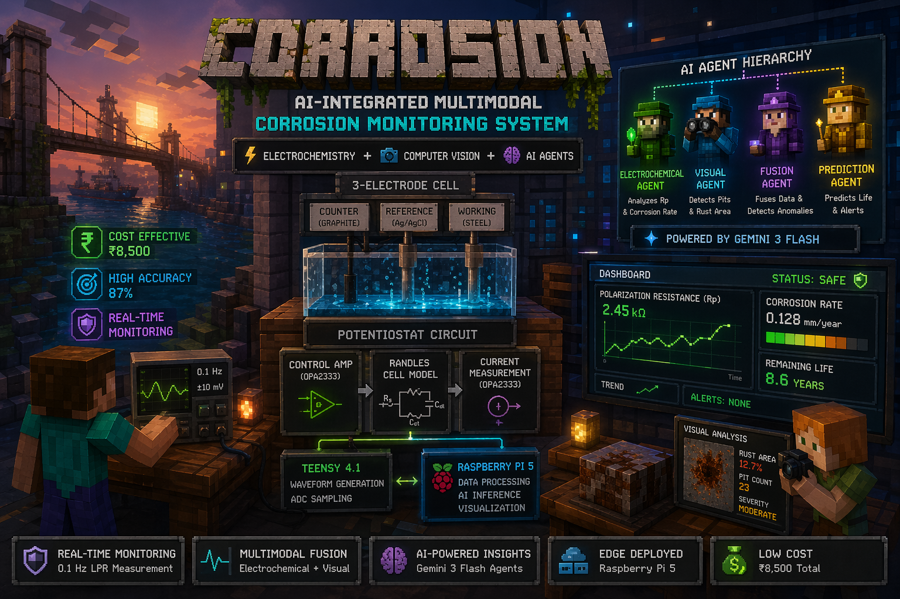
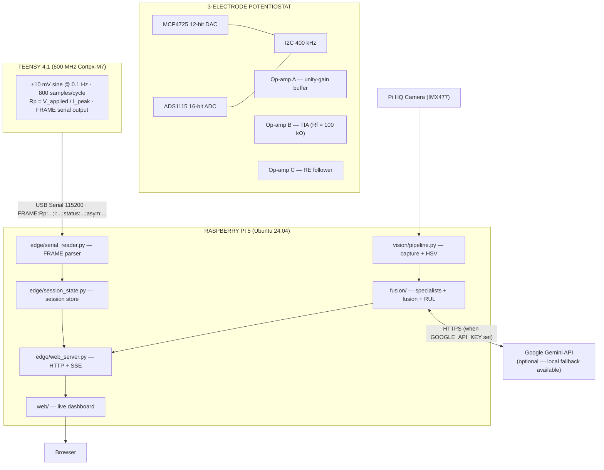

&nbsp;

<div align="center">



<h1>Corrosion Monitor</h1>

<h3>Real-Time Corrosion Detection.<br/>Custom Potentiostat · Computer Vision · Multi-Agent AI · Edge Deployment.</h3>

<p>
  <a href="log/project_log.md">Project Log</a> ·
  <a href="https://github.com/mohammedryn/Embedded-IoT-system-for-Industrial-Corrosion-Detection-and-Monitoring/issues/new?labels=bug">Report Bug</a> ·
  <a href="https://github.com/mohammedryn/Embedded-IoT-system-for-Industrial-Corrosion-Detection-and-Monitoring/issues/new?labels=enhancement">Request Feature</a>
</p>

&nbsp;

[](https://github.com/mohammedryn/Embedded-IoT-system-for-Industrial-Corrosion-Detection-and-Monitoring/stargazers)
[](https://github.com/mohammedryn/Embedded-IoT-system-for-Industrial-Corrosion-Detection-and-Monitoring/network/members)
[](LICENSE)
[](https://www.python.org/)
[](tests/)
[](https://www.pjrc.com/teensy/teensy41.html)

</div>

&nbsp;

An open-source, AI-integrated corrosion monitoring system that replaces ₹50,000+ commercial potentiostats with a ₹8,500 custom-built alternative. The system applies [Linear Polarization Resistance (LPR)](https://en.wikipedia.org/wiki/Linear_polarization_resistance) at 0.1 Hz using a 3-op-amp potentiostat circuit, captures surface images via a Pi HQ Camera, and fuses both signals through a multi-agent AI pipeline to produce real-time severity scores and remaining useful life (RUL) estimates.

The live data path runs fully on the edge — Teensy 4.1 generates the electrochemical perturbation, acquires 800 ADC samples per cycle, and streams validated `FRAME` packets over USB serial to a Raspberry Pi 5, where the ingestion layer, vision pipeline, Gemini specialist agents, and web dashboard all operate together. No cloud dependency is required for the core measurement path.

## Features

The system is organized into four integrated subsystems, each independently testable and replaceable.

- **Electrochemical sensing**: custom 3-op-amp potentiostat with 0.5 nA current sensitivity and ±5% Rp accuracy
- **Vision pipeline**: Pi HQ Camera surface capture with HSV-based rust coverage extraction and quality gating
- **AI fusion**: Gemini 3 Flash specialist agents for sensor analysis, visual inspection, conflict resolution, and RUL estimation
- **Live dashboard**: browser-based operator UI with SSE streaming, session management, and a 3-step lab workflow

| Sensing | Edge Compute | AI Pipeline | Operator Interface |
| :--- | :--- | :--- | :--- |
| 3-electrode potentiostat | Serial ingestion (FRAME protocol) | Sensor specialist agent | Live dashboard (SSE) |
| ±10 mV sine at 0.1 Hz | Session state management | Vision specialist agent | Lab Session GUI (3-step) |
| 16-bit ADS1115 ADC | HTTP + SSE web server | Fusion + conflict resolution | Rp / severity / RUL display |
| Rp severity classification | Bounded rolling buffer | RUL estimation (XGBoost advisory) | Phase markers + alerts |
| Asymmetry glitch detection | Reconnect + backoff logic | Local heuristic fallback | Operator controls |

## Architecture

The system is organized into three hardware layers and a software stack running on the Raspberry Pi 5.

- **Potentiostat circuit**: generates the electrochemical perturbation and measures the resulting current
- **Teensy 4.1**: firmware cycle engine that drives the DAC, samples the ADC, computes Rp, and emits FRAME packets
- **Raspberry Pi 5**: edge compute node running ingestion, vision, AI fusion, and the web dashboard



### Rp Severity Bands

| Rp Range | Status | Corrosion State |
| :--- | :--- | :--- |
| > 50 kΩ | EXCELLENT | Passive — negligible corrosion |
| 10 – 50 kΩ | GOOD | Mild activity |
| 5 – 10 kΩ | FAIR | Moderate corrosion |
| 1 – 5 kΩ | WARNING | Active corrosion |
| < 1 kΩ | SEVERE / CRITICAL | Aggressive active corrosion |

## Hardware

| Component | Part | Role |
| :--- | :--- | :--- |
| Microcontroller | Teensy 4.1 | Signal generation, ADC sampling, serial output |
| DAC | MCP4725 (I2C 0x60) | 12-bit, generates ±10 mV sine at 0.1 Hz |
| ADC | ADS1115 (I2C 0x48) | 16-bit, 860 SPS, reads TIA output |
| Op-amps | OPA2333 × 3 | Unity-gain buffer, TIA (Rf = 100 kΩ), RE follower |
| Single-board computer | Raspberry Pi 5 (8 GB) | Edge compute, AI inference, web server |
| Camera | Pi HQ Camera (IMX477) | Surface image capture via CSI-2 |

**Electrodes:** graphite counter, DIY Ag/AgCl reference (silver wire + bleach electrodeposition, ~₹250 vs ₹700 commercial), steel working electrode.

## Quick Start

### 1. Firmware (Teensy 4.1)

1. Install [Arduino IDE 2.3.x](https://www.arduino.cc/en/software) + [Teensyduino](https://www.pjrc.com/teensy/td_download.html)
2. Add libraries via Manage Libraries: `Adafruit MCP4725` · `Adafruit ADS1X15`
3. Open [`firmware/corrosion_potentiostat_resistor_test.ino`](firmware/corrosion_potentiostat_resistor_test.ino)
4. Board → **Teensy 4.1** | USB Type → **Serial** | CPU → **600 MHz** → Upload
5. Open Serial Monitor at **115200 baud** — confirm `FRAME:Rp:...` output

### 2. Edge Server (Raspberry Pi 5)

```bash
git clone https://github.com/mohammedryn/Embedded-IoT-system-for-Industrial-Corrosion-Detection-and-Monitoring.git
cd Embedded-IoT-system-for-Industrial-Corrosion-Detection-and-Monitoring
make bootstrap

# Optional: enable Gemini AI agents
export GOOGLE_API_KEY=your_key_here

python3 -m edge.web_server
```

Open [`http://localhost:8080`](http://localhost:8080) in a browser.

### 3. Connect Teensy

```bash
# Add serial port permission (Linux — log out and back in after)
sudo usermod -aG dialout "$USER"

# Start a new session
curl -sS -X POST http://127.0.0.1:8080/api/session/new | jq .

# Connect the Teensy
curl -sS -X POST http://127.0.0.1:8080/api/session/serial/connect \
  -H 'Content-Type: application/json' \
  -d '{"port":"/dev/ttyACM0","baud":115200}' | jq .

# Stream live readings (SSE)
curl -N -H 'Accept: text/event-stream' \
  'http://127.0.0.1:8080/api/session/readings/stream?last_seq=0'
```

## Validated Results

C01 hardware validation was performed using precision resistors substituted in place of the electrochemical cell, spanning the expected real-world Rp range from moderate to severe active corrosion. 115+ measurements across 9 runs and 3 resistor values.

| Test Resistor | Expected Rp | Measured | Error | Result |
| :--- | :--- | :--- | :--- | :--- |
| 10 kΩ (±1%) | 10,000 Ω | 9,663.9 Ω | −3.36% | Pass ✓ |
| 4.7 kΩ (±1%) | 4,700 Ω | 4,567.6 Ω | −2.81% | Pass ✓ |
| 2.2 kΩ (±1%) | 2,200 Ω | 2,160.4 Ω | −1.80% | Pass ✓ |

PRD acceptance criterion: < ±5%. Systematic offset confirmed as Rf tolerance (physical Rf = 102.671 kΩ). Correctable at runtime via `set rf 102671` without reflashing. The 3-op-amp Stage 2 circuit achieves 0.13% on the same reference.

## Project Structure

```
.
├── firmware/
│   └── corrosion_potentiostat_resistor_test.ino   # Teensy measurement cycle engine (426 lines)
├── edge/
│   ├── serial_reader.py      # FRAME protocol parser, bounded buffer, SSE callbacks
│   ├── session_state.py      # Thread-safe session store (photos + readings)
│   └── web_server.py         # ThreadingHTTPServer — HTTP API + SSE stream
├── vision/
│   └── pipeline.py           # rpicam-still capture, quality gating, HSV analysis
├── fusion/
│   ├── specialists.py        # Gemini sensor + vision specialist agents
│   ├── c06.py                # Weighted fusion, conflict detection, RUL
│   └── c07.py                # Phase state machine, dashboard orchestration
├── web/                      # HTML / JS / CSS live dashboard UI
├── tests/                    # 13 integration tests (serial, session, API, SSE)
├── data/sessions/            # Session artifacts — photos, readings, C01 bench data
├── docs/                     # Hardware validation reports
├── log/project_log.md        # Complete development log — every issue and resolution
└── Makefile                  # bootstrap · smoke-c00 … smoke-c07
```

## Implementation Status

| Phase | Component | Status |
| :--- | :--- | :--- |
| C00 | Bootstrap, config, structured logging | Done |
| C01 | Hardware bringup, potentiostat validation, firmware | Done — closed 2026-04-19 |
| C02 | Firmware compile baseline | Done |
| C03 | Serial ingestion, session APIs, SSE stream | Done — validated live 2026-04-25 |
| C04 – C07 | Vision, AI specialists, fusion, dashboard | Feature-complete on synthetic data |
| — | Real electrodes (steel in 3.5% NaCl) | Pending electrode availability |
| — | Pi HQ Camera physical connection | Pending |
| C08 | Fault injection, reliability drills | Not started |
| C09 | Full demo run, version freeze, sign-off | Not started |

## Contributing

> [!NOTE]
> This project is open source under the [MIT License](LICENSE). Contributions are welcome — open an issue first to discuss what you'd like to change. For hardware questions, include your wiring configuration and serial output. See [log/project_log.md](log/project_log.md) for the complete development history, every circuit issue encountered, and how each was resolved.

---
