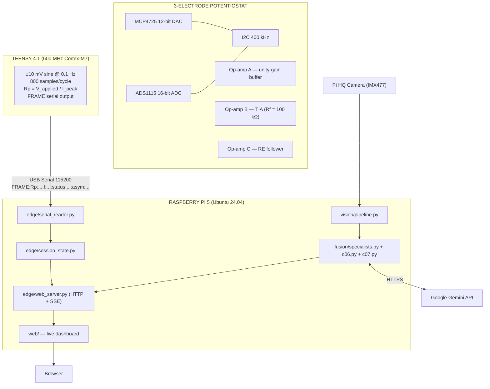

# Embedded IoT System for Industrial Corrosion Detection and Monitoring


---

## Overview

A real-time, AI-integrated corrosion monitoring system combining electrochemical impedance spectroscopy with computer-vision-based surface analysis. The system measures polarization resistance (Rp) using a custom 3-op-amp potentiostat, captures surface images via a Pi HQ Camera, and fuses both signals through a multi-agent AI pipeline to estimate corrosion severity and remaining useful life (RUL).

**Cost:** ₹8,500 (vs ₹50,000+ commercial solutions)

---

## Key Features

- **Custom potentiostat** — 3-op-amp design operating at 0.1 Hz; purpose-built for LPR since the commercial AD5933 operates at 1 kHz minimum, which short-circuits the electrochemical double layer
- **0.5 nA current sensitivity** — 16-bit ADS1115 ADC + 100 kΩ TIA feedback resistor
- **Live serial ingestion** — Teensy 4.1 → Pi 5 via USB; strict FRAME protocol parsing with SSE streaming to browser dashboard
- **Multi-agent AI fusion** — Gemini 3 Flash specialist agents for electrochemical analysis, visual inspection, and conflict resolution (falls back to local heuristics when `GOOGLE_API_KEY` is not set)
- **Lab Session GUI** — 3-step stepper (Capture → Measure → Analyze) at `http://localhost:8080`

---

## System Architecture



### Rp Severity Bands

| Rp Range | Status |
|----------|--------|
| > 50 kΩ | EXCELLENT |
| 10–50 kΩ | GOOD |
| 5–10 kΩ | FAIR |
| 1–5 kΩ | WARNING |
| < 1 kΩ | SEVERE / CRITICAL |

---

## Hardware

| Component | Part | Purpose |
|-----------|------|---------|
| Microcontroller | Teensy 4.1 | Signal generation, data acquisition, serial output |
| DAC | MCP4725 (0x60) | 12-bit, generates ±10 mV sine at 0.1 Hz |
| ADC | ADS1115 (0x48) | 16-bit, 860 SPS, reads TIA output |
| Op-amps | OPA2333 (×3) | Buffer, TIA, RE follower |
| Feedback resistor | 100 kΩ (±1%) | Sets TIA gain and current sensitivity |
| SBC | Raspberry Pi 5 | Edge compute, AI inference, web server |
| Camera | Pi HQ Camera (IMX477) | Surface image capture via CSI-2 |

**Electrodes:** Graphite counter, DIY Ag/AgCl reference (silver wire + bleach, ~₹250 vs ₹700 commercial), steel working electrode.

---

## Quick Start

### Firmware (Teensy)

1. Install Arduino IDE 2.3.x + Teensyduino; add libraries `Adafruit MCP4725` and `Adafruit ADS1X15`
2. Open `firmware/corrosion_potentiostat_resistor_test.ino`
3. Board → Teensy 4.1 | USB Type → Serial | CPU → 600 MHz → **Upload**
4. Serial Monitor at 115200 baud — confirm FRAME output

### Edge Server (Raspberry Pi)

```bash
cd ~/corrosion
make bootstrap          # install deps into .venv
make smoke-c00          # verify bootstrap
make smoke-c01          # verify tooling

# Optional: set Google AI key for Gemini agents
export GOOGLE_API_KEY=your_key_here

# Start server
python3 -m edge.web_server
```

Open `http://localhost:8080` in a browser.

### Connect Teensy

```bash
# New session
curl -sS -X POST http://127.0.0.1:8080/api/session/new | jq .

# Connect serial
curl -sS -X POST http://127.0.0.1:8080/api/session/serial/connect \
  -H 'Content-Type: application/json' \
  -d '{"port":"/dev/ttyACM0","baud":115200}' | jq .

# Live SSE stream
curl -N -H 'Accept: text/event-stream' \
  'http://127.0.0.1:8080/api/session/readings/stream?last_seq=0'
```

**Linux serial permissions:**
```bash
sudo usermod -aG dialout "$USER"   # log out and back in
```

---

## Validated Results (C01 — Resistor Substitution)

| Test Resistor | Expected Rp | Measured | Error |
|---------------|-------------|----------|-------|
| 10 kΩ (±1%) | 10,000 Ω | 9,663.9 Ω | −3.36% |
| 4.7 kΩ (±1%) | 4,700 Ω | 4,567.6 Ω | −2.81% |
| 2.2 kΩ (±1%) | 2,200 Ω | 2,160.4 Ω | −1.80% |

PRD acceptance criterion: < ±5%. All three pass.

---

## Project Structure

```
corrosion/
├── firmware/          # Teensy 4.1 Arduino sketch
├── edge/
│   ├── serial_reader.py   # FRAME protocol parser + SSE
│   ├── session_state.py   # Session store (photos + readings)
│   └── web_server.py      # ThreadingHTTPServer, HTTP + SSE
├── vision/
│   └── pipeline.py        # rpicam-still capture + HSV analysis
├── fusion/
│   ├── specialists.py     # Gemini sensor + vision agents
│   ├── c06.py             # Weighted fusion, conflict detection, RUL
│   └── c07.py             # Phase state machine, dashboard state
├── web/                   # HTML/JS/CSS dashboard UI
├── tests/                 # 13 passing integration tests
└── Makefile               # bootstrap, smoke targets
```

---

## Implementation Status (April 2026)

| Phase | Status |
|-------|--------|
| Hardware bringup, firmware, resistor validation (C01) | Done |
| Firmware compile baseline, Pi integration layer | Done |
| Vision, AI specialists, fusion, orchestration (C04–C07) | Feature-complete on synthetic/mock data |
| Serial ingestion + SSE stream (validated live) | Done |
| Lab Session GUI (3-step stepper) | Done |
| Real electrodes (steel in NaCl) | Pending electrode availability |
| Pi HQ Camera physical connection | Pending |

---

## License

This project is released under the [MIT License](LICENSE).
You are free to use, copy, modify, merge, publish, distribute, sublicense, and/or sell copies of the software, subject to the license terms.

---

## References

- Stern & Geary (1957), *J. Electrochem. Soc.* 104, 56 — polarization resistance theory
- ASTM G59 — standard practice for LPR measurements
- Adafruit MCP4725 / ADS1X15 Arduino libraries
- Google Gemini API (Gemini 3 Flash)
